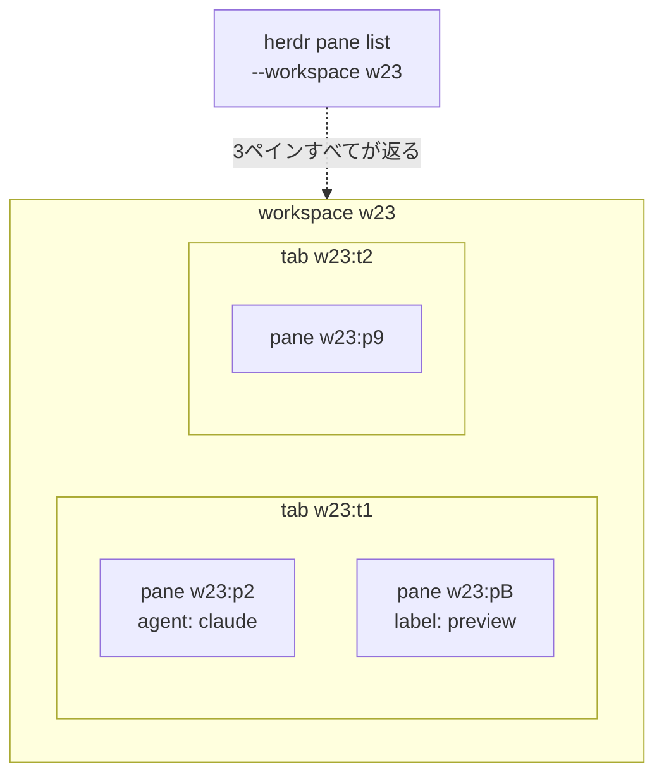
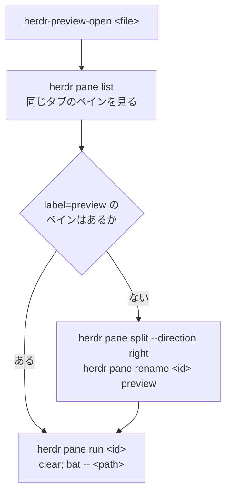

## 作ったもの

キーを押すとファイルツリーが開き、選んだファイルが隣のペインに残る、という道具を作りました。

```
1. 押す前                     2. prefix+alt+t              3. Enter を押す
+---------------------+     +---------------------+     +----------+----------+
|                     |     |  +---------------+  |     |          |  preview |
|  claude code        |     |  | .             |  |     |  claude  |  1  ---  |
|  (working...)       | --> |  | |-- app       |  | --> |  code    |  2  # H  |
|                     |     |  | |-- lib       |  |     |          |  3  ...  |
|                     |     |  +---------------+  |     |          |          |
+---------------------+     +---------------------+     +----------+----------+
   エージェントのペイン          popup が上に重なる          右に preview ペイン
```

土台は [Herdr](https://herdr.dev) という、コーディングエージェントを認識するターミナルマルチプレクサです。ペインの中で動いている Claude Code や Codex の状態（working / blocked / done / idle）をサイドバーに集めてくれます。

作ったものの中身は**シェルスクリプト2本と設定7行**だけで、Herdr のプラグイン機構は使っていません。

そして書いてみると、**いちばん手こずったのは fzf でも awk でもなく「出力をどのペインに送るか」でした**。素直に「右隣のペインに出す」と書くと、そこで動いているエージェントに向かってコマンド文字列を送ることになります。この記事は最後にそこへ着地します。

## この記事の対象者と前提

- **対象** — tmux のようなターミナルマルチプレクサを触ったことがある人。**Herdr は知らなくて大丈夫です**
- **前提知識** — fzf / awk / jq を使ったことがなくても読めるように、出てくる場所でその都度説明します
- **読み終わると** — 自分の Herdr に同じものを入れられます。あわせて「エージェントを並べて動かすときの落とし穴」がひとつ分かります

4つの Step に分けてあり、**それぞれの終わりに「ここまでで何が動くか」を書いています**。途中でやめても手元には動くものが残ります。

Herdr を使っていない方へ。Step 4 で書く問題は、tmux の `send-keys` でペインにコマンドを送る場合にも同じ構造で起こります。ただし tmux では試していないので、この記事で確かめたのは Herdr の話だけです。

## 検証環境

| 項目 | 値 |
| --- | --- |
| OS | macOS 26.3.1 (arm64) |
| herdr | 0.8.0（protocol 19） |
| fzf | 0.70.0 |
| bat | 0.26.1 |
| eza | 0.23.4 |
| jq | 1.8.1 |
| tree | 2.3.1 |
| 検証日 | 2026-08-24 |

この記事に貼ったコマンドの出力は、すべてこの環境で実行したものです。Linux / Windows では試していません。

完成したコードは [zenn-examples/herdr-popup-file-tree-preview](https://github.com/y-sakamoto-lu-llc/zenn-examples/tree/148a3f8c63a6436a1dc08f31454d3980ccd0ef24/herdr-popup-file-tree-preview) にあります。

## Herdr の地図 — workspace / tab / pane

この記事には `w23:t1` のような ID が出てきます。送信先を選ぶコードがこの構造をそのまま使うので、先に地図を見ておきます。

Herdr のペインは3段の入れ子です。**tmux の session / window / pane に近い**と考えると掴みやすいと思います（同じではありません）。



- **workspace** — リポジトリやタスクの単位。中のエージェントの状態がここに集約される
- **tab** — workspace の中のレイアウト。ペインの分割はタブごと
- **pane** — 実際のターミナルプロセス。エージェントが乗ることもあれば、素のシェルのこともある

Herdr は管理下の各ペインに、この3段に対応する環境変数を注入します。あとで書くスクリプトが「自分がどこに居るか」を知れるのはこのためです。

| 階層 | ID の形 | 環境変数 |
| --- | --- | --- |
| workspace | `w23` | `HERDR_WORKSPACE_ID` |
| tab | `w23:t1` | `HERDR_TAB_ID` |
| pane | `w23:p2` | `HERDR_PANE_ID` |

図の点線が後で効いてきます。**`herdr pane list` の絞り込みは workspace 単位**なので、返ってくるのは他のタブのペインも含めた全部です。プレビューを出したいのは自分と同じタブなので、Step 3 のコードは `tab_id` で絞り直します。

なお ID は不透明なハンドルとして扱ってください。連番に見えますが、この記事の検証中に `w23:p9` の次が `w23:pA` になりました。閉じたペインの ID も再利用されません。**文字列を組み立てて別のペインを指そうとしない**のが安全です。

## Step 1 — キーひとつで自作コマンドを開く

> **この Step のゴール**: `prefix+alt+t` を押すと窓が開く。中身は何でもいい。

Herdr はキーバインドに外部コマンドを割り当てられます。`~/.config/herdr/config.toml` に数行書くだけで、プラグインを書く必要はありません。

`prefix` は tmux と同じ考え方で、既定は `ctrl+b` です。`prefix+alt+t` は「`ctrl+b` を押してから `alt+t`」という意味になります。

### type を3つから選ぶ

`type` の選択で挙動がまったく変わります。

| `type` | 挙動 | 向いている用途 |
| --- | --- | --- |
| `shell` | 画面に出ないまま裏で走る | 通知を出す、ファイルを書く |
| `pane` | 一時的なペインを開き、コマンドが終わると閉じる | 短い出力を1回だけ見る |
| `popup` | 今のレイアウトの上に窓が重なる。閉じるまで他を操作できない | キーボードで操作する画面 |

ファイルツリーは fzf で操作する画面なので `popup` を選びます。

`pane` を選ぶと、開くたびにタブのレイアウトが変わります。つまり**隣で動いているエージェントのペインが毎回リサイズされる**ということです。エージェントの TUI（ターミナルの中に描かれる画面）は幅が変わると描き直しになるので、これは避けたい。`popup` は既存のレイアウトの上に重なるだけなので、下は動きません。`width` / `height` を割合で指定できるのも `popup` だけです。

### 設定を書く

```toml
[[keys.command]]
key = "prefix+alt+t"
type = "popup"
command = "$HOME/.config/herdr/bin/herdr-tree"
width = "85%"
height = "85%"
```

ひとつ罠があります。`[[keys.command]]` は TOML の**配列テーブル**という書き方で、二重の角括弧で始まるブロックです。この直後に `[ui]` のような普通のテーブルヘッダを書くと、以降の行がそちらに吸われてしまいます。**config.toml の末尾に置く**のが安全です。

動作確認のため、まずは中身のないコマンドを指定して構いません。

```toml
command = "echo hello; read"
```

書き換えたら、Herdr を再起動せずに反映できます。

```sh
herdr server reload-config
```

> ✅ **ここまでのチェックポイント**
> `prefix+alt+t` を押して窓が開けば OK です。開かない場合は `herdr config check` で設定の文法を確認してください。

## Step 2 — ツリーを fzf で選べるようにする

> **この Step のゴール**: 窓の中にファイルツリーが出て、右側にファイルの中身がプレビューされる。**ここまでは Herdr に依存しません。**

[fzf](https://github.com/junegunn/fzf) は、標準入力で受け取った行を絞り込んで1行選ばせるコマンドです。`ls | fzf` のように使います。

選ばせる行を作る側として `find` や `fd` でも動きますが、それだと**ディレクトリの入れ子が見えません**。ツリーの罫線を保ったまま選びたい。

### tree の出力はそのままでは使えない

`tree` の出力はこうなります。

```sh
$ tree -a --noreport -I '.git|node_modules|.DS_Store' -L 1
.
├── .gitignore
├── CLAUDE.md
├── ideas
├── index.md
└── notes
```

見た目はいいのですが、選ばれた行から `├── ` を剥がしてパスを組み立てるのは面倒です。深い階層では親ディレクトリを遡る必要もあります。

`tree -f` を使うとフルパスが出ます。

```sh
$ tree -f -a --noreport -I '.git|node_modules|.DS_Store' -L 1
.
├── ./.gitignore
├── ./CLAUDE.md
├── ./ideas
├── ./index.md
└── ./notes
```

パスは取れるようになりましたが、今度は**深い階層で行が長くなり、罫線がほとんど読めなくなります**。

### 見た目とデータを別の列に分ける

やったのは、1行を**タブ区切りの2列**に組み直すことです。左が画面に見せる用、右がプログラムが使う用。

```awk
awk -F'── ' '
  NF > 1 { p = $2; n = p; sub(/.*\//, "", n); printf "%s── %s\t%s\n", $1, n, p; next }
  { printf "%s\t.\n", $0 }
'
```

awk は「行ごとに、条件にあてはまればブロックを実行する」言語です。上のコードは1行ずつ読むとこうなっています。

| 書いたもの | 意味 |
| --- | --- |
| `-F'── '` | 罫線とパスの境目（`── `）を区切り文字にする |
| `$1` / `$2` | 区切りで分けた1つ目 / 2つ目。ここでは罫線 / フルパス |
| `NF > 1` | 区切りが1個以上見つかった行だけ、つまりファイルやディレクトリの行だけ |
| `p = $2; n = p` | フルパスを `p`、加工用のコピーを `n` に置く |
| `sub(/.*\//, "", n)` | `n` の中で「最後の `/` までの全部」を空文字に置換する。結果はベース名 |
| `printf "%s── %s\t%s\n", $1, n, p` | 「罫線 + ベース名」「タブ」「フルパス」の順に出す |
| `next` | この行の処理はここで終わり。次の行へ進む |
| 最後の `{ ... }` | 条件のないブロック。`next` で抜けなかった行、つまり区切りが無いルートの `.` だけがここに来る |

通した結果です（区切りのタブを `<TAB>` と書いています）。

```
.            <TAB>  .
├── .gitignore  <TAB>  ./.gitignore
├── CLAUDE.md   <TAB>  ./CLAUDE.md
├── ideas       <TAB>  ./ideas
├── index.md    <TAB>  ./index.md
└── notes       <TAB>  ./notes
```

### fzf に「左だけ見せて、右を渡せ」と伝える

```sh
fzf --ansi --no-sort --layout=reverse --delimiter=$'\t' --with-nth=1 \
    --preview 'test -f {2} && bat --color=always --style=numbers --line-range=:200 -- {2} || eza --tree --level=2 --color=always -- {2}' \
    --preview-window 'right,55%,border-left'
```

使っているオプションはこれだけです。

| オプション | 意味 |
| --- | --- |
| `--delimiter=$'\t'` | 各行をタブで列に分ける |
| `--with-nth=1` | **画面に見せるのは1列目だけ** |
| `{2}` | プレビューやキー操作の中で**2列目の値に展開される**プレースホルダ |
| `--preview '...'` | 選択中の行に対して実行し、結果を横に出すコマンド |
| `--preview-window 'right,55%,border-left'` | プレビューを右側に 55% の幅で出す |
| `--ansi` | 入力に含まれる色のエスケープを色として解釈する |
| `--no-sort` | 絞り込みスコアで並べ替えない。**ツリーの順序を保つために必須** |
| `--layout=reverse` | 一覧を上から下へ表示する |

プレビューは `test -f {2}` でファイルとディレクトリを分け、ファイルなら [bat](https://github.com/sharkdp/bat)（行番号付きで色を付ける `cat`）、ディレクトリなら [eza](https://github.com/eza-community/eza)（`ls` の後継）でその中のツリーを出しています。

**この2列への分離が、あとの全部の土台になります。** 罫線を剥がす正規表現を書くより、最初から混ぜない方が壊れません。

> ✅ **ここまでのチェックポイント**
> `tree` から `fzf` までを1本のスクリプトにして実行すると、ツリーから選べるファイラーになります。**この時点で Herdr は関係ありません。** 手元のシェルで `./herdr-tree` として動きます。

## Step 3 — 選んだファイルを隣のペインに出す

> **この Step のゴール**: Enter を押すと popup が閉じ、右のペインにファイルの中身が残る。

fzf のプレビューは popup の中にあるので、Enter を押して popup が閉じると消えてしまいます。残しておきたいので、Herdr のペインに出します。

### Enter で外部スクリプトを呼ぶ

fzf は `--bind` でキーに動作を割り当てられます。

```sh
--bind "enter:execute-silent($here/herdr-preview-open {2})+abort"
```

- `execute-silent(...)` — 外部コマンドを実行し、その出力を画面に出さない
- `+abort` — 続けて fzf を終了する（popup が畳まれる）
- `{2}` — Step 2 と同じ。選んだ行の2列目、つまりフルパスが渡る

popup が閉じたときには、外側のペインがもう書き換わっている、という見え方になります。

### 自分がどこに居るかを知る

呼ばれた側のスクリプトは、まず自分の居場所を環境変数から取ります。

```sh
herdr="${HERDR_BIN_PATH:-herdr}"
ws="${HERDR_ACTIVE_WORKSPACE_ID:-${HERDR_WORKSPACE_ID:?}}"
tab="${HERDR_ACTIVE_TAB_ID:-${HERDR_TAB_ID:?}}"
src="${HERDR_ACTIVE_PANE_ID:-${HERDR_PANE_ID:?}}"
```

bash のパラメータ展開を2種類使っています。

| 書き方 | 意味 |
| --- | --- |
| `${VAR:-値}` | `VAR` が未設定または空なら「値」を使う。**代替値** |
| `${VAR:?}` | `VAR` が未設定または空ならエラーを出して即終了する。**必須チェック** |

つまり `${HERDR_ACTIVE_WORKSPACE_ID:-${HERDR_WORKSPACE_ID:?}}` は「`HERDR_ACTIVE_WORKSPACE_ID` があればそれ、無ければ `HERDR_WORKSPACE_ID`、それも無ければエラーで止まる」です。

`HERDR_ACTIVE_*` の方は**公式ドキュメントに記載がありません**（`herdr --skill` にも `herdr --default-config` にも出てきません）。バイナリの中に文字列として存在するのを確認できるだけなので、地図の表にあった3つへフォールバックさせてあります。

ツリーの起点も同じ考え方です。

```sh
cd "${HERDR_ACTIVE_PANE_CWD:-$PWD}"
```

これで、ワークスペースごとに別のリポジトリを開いていても設定は1つで済みます。

### まず素直に書いてみる

やりたいのは「右にペインを作って、そこで `bat` を実行する」です。素直に書くとこうなります。

```sh
# 押すたびにペインが増えてしまう版
pane=$("$herdr" pane split --pane "$src" --direction right --ratio 0.45 \
         --cwd "$PWD" --no-focus | jq -r '.result.pane.pane_id')
"$herdr" pane run "$pane" "bat -- $target"
```

Herdr の CLI は JSON を返すので、[jq](https://jqlang.github.io/jq/)（JSON を絞り込むコマンド）で新しいペインの ID を取り出しています。`--no-focus` は「作るけれどフォーカスは移さない」指定です。

これは1回目はうまくいきます。**2回目に押すとペインが2枚になります。** 3回押せば3枚です。

### 一度作ったペインを使い回す

そこで、作ったペインに**しるしを付けて**おき、次からはそれを探して使います。Herdr にはペインに名前を付ける `pane rename` があるので、これを使います。

```sh
pane=$("$herdr" pane list --workspace "$ws" | jq -r --arg tab "$tab" '
  .result.panes[]
  | select(.tab_id == $tab and .label == "preview")
  | .pane_id' | head -1)

if [ -z "$pane" ]; then
  pane=$("$herdr" pane split --pane "$src" --direction right --ratio 0.45 \
           --cwd "$PWD" --no-focus | jq -r '.result.pane.pane_id')
  "$herdr" pane rename "$pane" preview
fi
```

`pane list` は workspace 全体を返すので（地図の点線です）、`tab_id` で自分のタブに絞り、さらに `label` が `preview` のものを探します。見つからなければ作って名前を付ける。

流れをまとめるとこうなります。



> ✅ **ここまでのチェックポイント**
> 動きます。ツリーから選ぶと右にプレビューが出て、2回目以降もペインは増えません。
> **ただし、まだ事故ります。** それが Step 4 です。

## Step 4 — エージェントのペインを守る

> **この Step のゴール**: 送信先を「位置」ではなく「属性」で選ぶ。

### pane run は思っているより素朴

`herdr pane run <pane_id> <command>` は、名前から想像するより素朴な操作です。**指定したペインのシェルにテキストを送って Enter を押すだけ**で、そのペインで何が動いているかは見ていません。

つまり送り先が Claude Code のペインだったら、

```
clear; bat --style=numbers,header --paging=never -- /path/to/file.md
```

この文字列が、**エージェントへのプロンプトとして送信されて Enter される**ということです。エージェントがそれを見て何をするかは、そのエージェント次第です（危ないので実際には試していません）。少なくとも、意図しない入力が会話に混ざります。

これは Herdr の CLI 全体に共通する性質です。公式のエージェント向けスキルにも「対象を省略すると UI でフォーカス中のペインに送られるので `--current` を使え」と書かれています。ただし**書かれているだけで、送り先を検査する仕組みはありません**。

### 「右隣に出す」がなぜ危ういか

Herdr には `herdr pane neighbor --direction right` という、隣のペインを教えてくれるコマンドがあります。これを使って「右隣に出す」と書くのがいちばん短いのですが、**右隣に誰が居るかはそのときのレイアウト次第**です。エージェントを2つ並べていれば、右隣はエージェントです。

Step 3 で `label` を見るようにしたのは半分正解でした。あと1つ足りません。

### 3つの条件で選ぶ

```sh
pane=$("$herdr" pane list --workspace "$ws" | jq -r --arg tab "$tab" '
  .result.panes[]
  | select(.tab_id == $tab and .label == "preview" and (.agent // null) == null)
  | .pane_id' | head -1)
```

条件は3つです。

1. `tab_id` が同じ — 別のタブのペインに出しても見えない
2. `label` が `preview` — 自分が作って名前を付けたペインだけを再利用する
3. **`agent` が無い — エージェントが乗っているペインは選ばない**

3つ目が保険です。ラベルは手で付け替えられますし、`preview` と名付けたペインで後からエージェントを起動することもできます。そのときにラベルだけで選んでいたら事故ります。

jq の `//` は「左が `null` か `false` なら右を使う」という演算子です。`.agent // null` と書いているのは、**キーそのものが存在しない場合**を揃えて扱うためです（詳しくは後述のつまずきポイントで）。

### 実際に確かめた

Claude Code が動いているペイン（`w23:p2`）に `preview` というラベルを付けてから、スクリプトを直接呼びます。fzf を経由せずに叩くので、popup が渡す環境変数は手で与えています。

```sh
$ herdr pane rename w23:p2 preview
$ herdr pane list --workspace w23 | jq -r '.result.panes[] | "\(.pane_id) label=\(.label // "—") agent=\(.agent // "—")"'
w23:p2 label=preview agent=claude

$ HERDR_ACTIVE_WORKSPACE_ID=w23 HERDR_ACTIVE_TAB_ID=w23:t1 HERDR_ACTIVE_PANE_ID=w23:p2 \
    ~/.config/herdr/bin/herdr-preview-open index.md
$ herdr pane list --workspace w23 | jq -r '.result.panes[] | "\(.pane_id) label=\(.label // "—") agent=\(.agent // "—")"'
w23:p2 label=preview agent=claude
w23:pB label=preview agent=—
```

`w23:p2` は選ばれず、新しいペイン `w23:pB` が作られました。**ラベルが一致していても、エージェントが乗っているペインには送られていません。**

3つの状況を通しで確認した結果です。

| 状況 | 結果 |
| --- | --- |
| preview ペインなし | 右に 45% で split され、`label=preview` が付く |
| preview ペインあり | **ペインは増えず、同じペインが書き換わる** |
| エージェントが乗ったペインに `preview` ラベル | 選ばれず、別ペインが新規作成される |

## つまずきポイント集

### label と agent は「キーごと存在しない」ことがある

**症状** — `jq` で `.label` や `.agent` を使った条件が、思ったように効かない。型を仮定した書き方をするとエラーになる。

**原因** — Herdr の応答は、**未設定のキーをそもそも返しません**。

```json
{ "pane_id": "w23:pC", "tab_id": "w23:t3", "workspace_id": "w23", "agent_status": "unknown", "focused": false }
{ "pane_id": "w23:pD", "tab_id": "w23:t3", "workspace_id": "w23", "agent_status": "unknown", "focused": false, "label": "preview" }
```

上が素のシェルのペイン、下が `preview` と名付けたペインです。`label` はラベルを付けたときだけ現れ、`agent` はエージェントが居るときだけ現れます。

**対処** — jq では存在しないキーへのアクセスは `null` になるので、`.label == "preview"` はそのまま書けます。ただし型を仮定する書き方（`.label | test("...")`）は落ちます。`// null` を挟んで「無い」と「null」を揃えてから比較するのが安全です。

### 空白を含むファイル名で壊れる

**症状** — `a b c.md` のようなファイルを選ぶと、プレビューが出ない。

**原因** — `pane run` に渡すのは**1本のコマンド文字列**です。シェルに送られてから解釈されるので、クォートは呼ぶ側の責任になります。

**対処** — `printf %q` でシェル用にエスケープしてから埋め込みます。あわせて絶対パスに直します（相対パスのままだと preview ペインの cwd 次第で開けません）。

```sh
abs="$(cd "$(dirname "$target")" && pwd)/$(basename "$target")"
"$herdr" pane run "$pane" \
  "clear; bat --style=numbers,header --paging=never -- $(printf %q "$abs")"
```

### pane read だけ JSON を返さない

**症状** — `herdr pane read` の結果を `jq` に渡すと `parse error` になる。

**原因** — 他の `pane` サブコマンドは JSON を返しますが、`pane read` はペインの表示内容をプレーンテキストで返します。

**対処** — `jq` を通さず、そのまま `grep` や `tail` で扱います。

### ツリーに余計なものが並ぶ

**症状** — `node_modules` や `.venv` の中身がツリーを埋め尽くす。

**原因** — `tree -I` の除外パターンは自分で書く必要があります。

**対処** — 使っている言語やエディタに合わせて足します。`.git|node_modules|.DS_Store` を出発点に、Python なら `.venv`、Rust なら `target`、Obsidian を使っているなら `.obsidian` を加えます。

## まとめ

- **Herdr のカスタムコマンドは `type = "popup"` を選べば、プラグインを書かずに、レイアウトを壊さずに道具を足せる。** 設定7行から始められる
- **見た目とデータは列で分ける。** `tree -f` の出力を awk でタブ区切り2列にし、fzf の `--with-nth=1` と `{2}` で受け渡す。罫線を剥がす正規表現より壊れにくい
- **エージェントを並べる環境では、出力の送り先を「位置」で決めない。** `herdr pane run` は送り先で何が動いているかを見ないので、`tab_id` / `label` / `agent` のような属性で選ぶ

作ったのは60行ほどのシェルスクリプトですが、**エージェントを並べて動かす環境では「どこに出力を送るか」が最初に考えることになる**、というのがいちばんの収穫でした。
