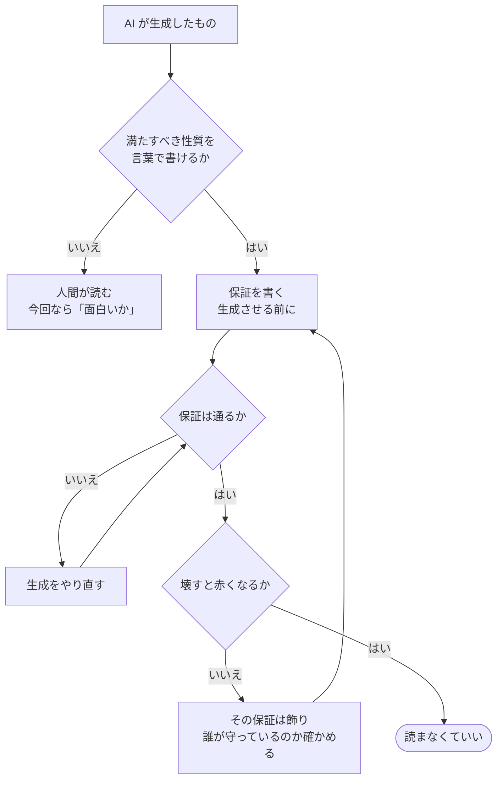

AI にコードやデータを作らせると、量はいくらでも出てきます。困るのは読む側で、全部読むのは最初から不可能です。かといって読まずに使うと、何が入っているか誰も説明できないものが積み上がります。

この状態は **理解負債（comprehension debt）** と呼ばれるようになりました（[Addy Osmani, 2026](https://addyosmani.com/blog/comprehension-debt/)）。症状の記述はそのとおりなのですが、対策が「理解する仕事は無くならない」という規範で止まっていて、全部読むのが不可能な以上そのままでは実行できません。

この記事は、その板挟みを1つのプロダクトで実際にやってみた記録です。題材は、本番障害の犯人を SQL で捜すブラウザゲーム。**事件データ（SQLite の7テーブル）を AI に生成させ、私はそれを全部読まずに「解ける」と言えるか**を試しました。

結論から言うと、読まずに使うことはできました。ただし**保証を9件書いて全部緑になった時点では、まだ何も確かめられていませんでした**。壊してみて初めて、そのうち1件が最初から一度も働いていなかったことが分かります。

## この記事で書くこと・書かないこと

書くこと。

- AI 生成物を読まずに使うために、何を機械が判定できて、何ができないか
- 保証を先に置いてからデータを生成する順序と、その実装
- 全部緑のあとに「壊して赤くなるか」を確かめる工程と、そこで見つかったもの
- **この運用を採るかどうかを決めるための、実際にかかった行数**

書かないこと。

- ゲームの面白さ・難易度の設計。**これは機械で判定できないので、この記事の対象外です**
- SQL パズルの作り方一般
- 長期運用の結果。このプロダクトは初日で、まだ誰にも遊ばれていません
- リポジトリの初日に何を置くか（デプロイとロールバック、`CLAUDE.md`）。**別の話なので次回に回します**
- **認知負債**（システム全体の見取り図が失われる話）。扱うのは生成物1つを説明できるかどうかまでです

## 検証環境

| 項目 | 値 |
| --- | --- |
| OS | macOS 15.3 (arm64) |
| Node.js | 26.4.0 |
| TypeScript | 6.0.2 |
| Vite | 8.2.2 |
| sql.js | 1.14.2 |
| SQLite | `node:sqlite`（Node 26.4.0 同梱） |
| 検証日 | 2026-08-31 |

コードと、実際に遊べるものはこちらです。

- 第1話: https://y-sakamoto-lu-llc.github.io/incident-mystery-game/
- リポジトリ（この記事の時点）: https://github.com/y-sakamoto-lu-llc/incident-mystery-game/tree/5069733f88e841b385731d6362fcb59cd1b87c44
- この記事の再現用コード（依存なし・`node verify.mjs` だけで動きます）:
  https://github.com/y-sakamoto-lu-llc/zenn-examples/tree/492f6d74824c5fef069fb8bdc7ebbd5e9a4a20b9/incident-game-day0-verify

## 結論

先に、この記事全体の見方を1行で書きます。

> **理解負債は「読まなかったこと」の負債ではなく、「読まなくていい境界が設計されていないこと」の負債。**

そのうえで3つあります。

1. **AI 生成物を読まずに使えるかは、生成物の質ではなく、保証を先に書けるかで決まる。** 「解ける」「時系列に矛盾がない」「誤誘導が否定できる」は機械が判定できました。「面白いか」は判定できないので、そこだけ人間が読みます
2. **保証が全部緑になっても、その保証が働いた証拠にはならない。** 壊して赤くなることを確かめて初めて、それは読まずに済ませられる約束になります
3. **保証を書かなかった場所が、そのまま読むべき場所になる。** これは事後に気づいたのではなく、書かなかった場所を数えれば先に分かります

この3つは、実際には1つの手順としてつながっています。**判定が2段ある**ことと、**2段目で落ちたときに戻る先**が要点です。



緑になった時点で止めると、`q3` を通らずに `ok` へ抜けたことになります。**この記事は、そこで抜けると何を見落とすかの記録です。**

## 何を作っているか

題材は、本番障害の犯人を SQL で捜すブラウザゲームです。証拠（デプロイ、コミット、Slack、ログ、アラート、設定変更、従業員）を7つのテーブルに入れておき、プレイヤーは SQL だけで捜査します。

第1話の筋は、金曜の深夜に決済バッチが二重に走って二重請求が起き、`#incident` では18時のデプロイが疑われているが**それは無罪**で、真犯人は数週間前の設定変更に埋まった UTC の cron、というものです。

**ここで重要なのは、この事件データを AI に生成させたことだけです。** 全部で194行あり、そのうち146行はバッチの実行ログです。1話なら読めますが、10話・20話と作るなら、全部読む前提は最初から破綻しています。

以降、ゲームの設計そのものには立ち入りません。**「生成させたデータを読まずに使えるか」だけを見ます。**

## 3つの負債を混ぜない

先に用語を整理します。似た言葉が3つ流通していますが、**返し方が違う**ので混ぜると打ち手が消えます。

| 負債 | 失われているもの | どう返すか |
| --- | --- | --- |
| **技術的負債** | コードの性質（重複・複雑さ・古さ） | **コードを直す** |
| **理解負債** | この1本を**なぜこう書いたか**を説明できる状態 | 読む、または**境界を作る** |
| **認知負債** | システム全体の見取り図 | 設計をやり直す／人が入れ替わる |

**理解負債はコードを1行も変えずに返せるし、コードを綺麗にしても返りません。** ここが技術的負債と決定的に違うところで、「リファクタしておけば大丈夫」は答えになりません。

認知負債は Margaret-Anne Storey が [先に使っていた語](https://margaretstorey.com/blog/2026/02/09/cognitive-debt/) で、個々のコードではなくシステム全体を指すぶん広い概念です。**この記事が扱うのは真ん中だけです。**

## AI 生成コードだけが3つとも欠けている

なぜ AI の生成物だけが問題になるのか。私たちはコンパイラの出力を読みませんが、それを問題だと思う人はいません。

境界の下を読まなくて済むのは、3つの条件が揃っているときだけです。

| | 決定論 | 明文化された保証 | 共有（他人が先に踏む） |
| --- | --- | --- | --- |
| コンパイラの出力 | あり | あり（言語仕様） | あり（世界中） |
| OSS ライブラリ | あり | あり（API ドキュメント・型） | あり |
| **AI 生成物** | **なし** | **なし** | **なし** |

同じ指示で違うものが出てくるので決定論がなく、生成物そのものが仕様なので明文化された保証がなく、このリポジトリにしかないので他人が先に踏んでくれません。**1つ欠けるだけなら埋められますが、3つとも欠けています。**

ここで「同じ指示を使い回せば、同じものが出るようにできるのでは」と考えたくなります。ですが**仮に生成が完全に安定したとしても、埋まるのは決定論の1つだけ**です。

**決定論は「同じ指示から同じものが出る」という生成手続きの再現性であって、出てきたものの性質についての約束ではありません。** 毎回そっくり同じ194行が出るようになっても、それが解けるかどうかは何も言っていません。決定論的に壊れているデータは、やはり壊れています。

コンパイラの出力を読まなくていい理由を考えると分かります。理由は決定論ではなく、**言語仕様という明文化された保証と、世界中が同じものを使っていること**です。仕様書も他の利用者も無く決定論だけがあるコンパイラなら、私たちは出力を読むはずです。

そして今回の場合、決定論はそもそも関係がありません。**事件データは `data.sql` として git に入っていて、すでに凍っています。** 問題は「もう一度同じものを生成できるか」ではなく、「凍った194行について性質を言えるか」だけです。

だから、生成させる前に保証を書きます。

## 保証を先に置く

コードを書く順序が普段と逆になります。データを作ってからテストを書くのではなく、**何が成り立っていれば読まずに使えるかを先に宣言してから、それを満たすデータを生成させます**。

第1話で宣言したのは9件です。抜粋します。

```js
// cases/001-timezone/guards.mjs
export default [
  {
    name: '二重実行が始まった日を SQL で特定できる',
    sql: `
      WITH runs AS (
        SELECT substr(occurred_at, 1, 10) AS day, COUNT(*) AS n
        FROM error_logs
        WHERE service = 'billing-batch' AND message LIKE 'batch started%'
        GROUP BY day
      )
      SELECT day, n FROM runs WHERE n >= 2 ORDER BY day LIMIT 1
    `,
    expect: { first: { day: '2026-07-25', n: 2 } },
  },
  {
    name: '疑われたデプロイは決済に触っていない（SQL で無罪を示せる）',
    sql: `
      SELECT c.sha, c.files_changed
      FROM deploys d JOIN commits c ON c.sha = d.sha
      WHERE d.id = 12 AND c.files_changed LIKE '%billing%'
    `,
    expect: { empty: true },
  },
];
```

1件目が「解けること」、2件目が「誤誘導が誤誘導として機能すること」の保証です。誤誘導は、プレイヤーが素直に追いかけたときに**証拠で否定できないと成立しません**。疑わしいだけで否定もできない情報は、誤誘導ではなくただのノイズです。

残りは、原因が症状より前に起きていること、変更前は1日1回しか走っていないこと、原因の設定変更が1件に絞れること、アラートが症状より後に鳴っていること、などです。

これに加えて、全事件に共通する保証を3つ置きました。参照先の存在、時刻の形式、証拠テーブルが空でないこと。

判定は `node:sqlite` で回します。Node 26 には SQLite が同梱されているので、この工程に依存パッケージは要りません。

```js
import { DatabaseSync } from 'node:sqlite';

const db = new DatabaseSync(':memory:');
db.exec(readFileSync('cases/schema.sql', 'utf8'));
db.exec(readFileSync('cases/001-timezone/data.sql', 'utf8'));
```

## 全部緑になった

保証を書いてから、事件データを生成させました。走らせるとこうなります。

```
$ npm run verify:cases

[001] 二重請求の夜
  ok   参照先の存在（PRAGMA foreign_key_check） — 孤児なし
  ok   時刻の形式が揃っている — 6 カラム
  ok   証拠のテーブルが空でない — 7 テーブル
  ok   二重実行が始まった日を SQL で特定できる — {"day":"2026-07-25","n":2}
  ok   変更前は1日1回しか走っていない — {"max_runs":0}
  ok   原因の設定変更が1件に絞れる — {"id":7,"target":"billing.batch.schedule", ...}
  ok   原因は最初の二重実行より前に起きている — 2026-07-24 11:20:00 < 2026-07-25 03:00:00
  ok   疑われているデプロイが Slack に実在する — 3 件
  ok   疑われたデプロイは決済に触っていない（SQL で無罪を示せる） — 0 行
  ok   二重実行は疑われたデプロイより前から始まっている — 2026-07-25 03:00:00 < 2026-08-14 18:05:00
  ok   アラートは症状より後に鳴っている — 2026-08-14 23:52:00 > 2026-07-25 03:00:00
  ok   答え合わせのテーブルが空で始まる — {"n":0}

保証はすべて通った。
```

12件が緑になりました。ここで終わりにしたくなります。

**しかし、これで確かめられたことは実はほとんどありません。** 全部緑になるデータを作っただけで、保証のほうが本当に働いたのかは分かっていないからです。緑は「破れなかった」を意味しますが、そもそも破れない保証も同じ緑になります。

## 壊して赤くなるか

そこで、壊し方を9通り宣言しました。それぞれについて「落ちるはずの保証」を書いておき、実際に落ちるかを見ます。

```js
// cases/001-timezone/mutations.mjs
export default [
  {
    name: '原因の設定変更を消す',
    sql: `DELETE FROM config_changes WHERE id = 7`,
    mustFail: ['原因の設定変更が1件に絞れる', '原因は最初の二重実行より前に起きている'],
  },
  {
    name: '疑われたデプロイが本当に決済に触っていたことにする',
    sql: `UPDATE commits SET files_changed = files_changed || ',app/billing/charge.rb'
          WHERE sha = 'a3f9c21'`,
    mustFail: ['疑われたデプロイは決済に触っていない（SQL で無罪を示せる）'],
  },
];
```

`mustFail` に挙げた保証が落ちなければ、その保証は飾りです。走らせます。

```
$ npm run verify:mutations

[001] 二重請求の夜 — 壊して赤くなるか
  ok   原因の設定変更を消す — 2 件が赤くなった
  ok   原因を症状より後にずらす — 2 件が赤くなった
  ok   二重実行そのものを消す — 1 件が赤くなった
  ...
```

ここまでは順調でした。8件目で落ちます。

```
Error: FOREIGN KEY constraint failed
    at runGuards (.../scripts/run-guards.mjs:95:35) {
  code: 'ERR_SQLITE_ERROR',
  errcode: 787,
  errstr: 'constraint failed'
}
```

存在しない従業員 ID を指す `deploys` を差し込んで、`PRAGMA foreign_key_check` の保証が落ちることを確かめようとした行です。**壊そうとしたら、壊せませんでした。**

## 飾りだった1件

理由を確かめます。

```sh
$ node -e "const {DatabaseSync}=require('node:sqlite');
  const db=new DatabaseSync(':memory:');
  console.log(db.prepare('PRAGMA foreign_keys').get());"
{ foreign_keys: 1 }
```

**`node:sqlite` は `foreign_keys` を既定で ON にします。** SQLite 本体の既定は OFF なので、`sqlite3` コマンドの感覚でいると逆です。

つまり孤児データは INSERT の時点でエンジンが弾いており、**私が書いた `PRAGMA foreign_key_check` の保証は、一度も発火していませんでした**。参照整合性は確かに守られていましたが、守っていたのは私の書いたチェックではなく、一段下のエンジンでした。

これは「保証が足りない」のとは違う失敗です。保証は実在していて、緑も出ていて、しかし**その保証を誰が与えているかを取り違えていた**。私のチェックを消しても、何も起きなかったはずです。

気づけたのは、壊してみたからです。緑を眺めているだけでは分かりません。

対処として、外から `.sqlite` を書き換えられた場合を模す形に変えました。ファイルとして配布する以上、その経路は実在します。

```js
{
  // node:sqlite は foreign_keys を既定で ON にするので、普通に INSERT すると
  // ここに来る前に engine が弾く。外から .sqlite を書き換えられた場合を模して
  // 強制を切ってから壊す。参照整合性の保証は自分の check ではなく engine 側にある。
  name: '存在しない人がデプロイしたことにする（外部で書き換えられた .sqlite を模す）',
  sql: `PRAGMA foreign_keys = OFF;
        INSERT INTO deploys (id, deployed_at, service, sha, deployed_by)
        VALUES (77, '2026-08-01 10:00:00', 'billing-batch', 'b71e0a4', 999)`,
  mustFail: ['参照先の存在（PRAGMA foreign_key_check）'],
}
```

これで9通りすべてが赤くなりました。

```
壊したぶんは全部赤くなった。
```

## verify は1本にする

置いたものを1コマンドにまとめます。

```json
{
  "scripts": {
    "verify": "npm run typecheck && npm run build:db && npm run verify:cases && npm run verify:mutations && npm run build"
  }
}
```

型が通り、事件データが生成でき、**それが解けて、壊すと赤くなり**、ビルドが通る。この5段が1本に入っています。

**保証は、放っておいても回る場所に置かないと意味がありません。** 思い出したときに走らせる運用だと、結局は読んで確かめることに戻ります。手元と CI で同じ1行を通し、デプロイ前のゲートにしました。

```yaml
- run: npm ci
# 保証を通してからでないとデプロイしない。verify 1本がそのままゲートになる。
- run: npm run verify
```

## 答えを配布物から落とす

もう1つ、静的サイト特有の穴がありました。

事件のメタデータには正解が入っています。

```json
{
  "id": "001",
  "title": "二重請求の夜",
  "briefing": "8月14日（金）の深夜、決済バッチが二重に走り ...",
  "answer": "cron が UTC で書かれていた",
  "answerRef": { "table": "config_changes", "id": 7 }
}
```

これをそのまま配ると、ブラウザに答えが届きます。ビルド時に提示情報だけを書き出すようにして、**その工程自体を保証で見張ることにしました**。

```js
const leaked = ['answer', 'answerRef', 'redHerringRef'].filter((k) => k in shipped);
return { ok: leaked.length === 0, ... };
```

```
  ok   配布物に答えが入っていない — 提示情報だけ
```

「気をつける」ではなく、破ると赤くなる形にしておきます。人が読んで守るルールは破れますが、機械が判定する約束は破ると止まります。

## 保証を書かなかった場所が、読むべき場所になる

ここまでで、証拠7テーブルのうち中身まで判定しているのは6つです。残る1つは `employees` で、「空でないこと」しか見ていません。

そこには休暇の記録が入っています。`#incident` には「中村さんは休暇中です」という発言もあります。しかし**アリバイと休暇の整合は、誰も保証していません**。第1話では答えに絡まないので通していますが、次に人が読むべき場所はここだと最初から分かっています。

| | 機械が判定できた | 判定できない |
| --- | --- | --- |
| 解ける | ✓ | |
| 時系列に矛盾がない | ✓ | |
| 誤誘導が SQL で否定できる | ✓ | |
| 答えが配布物に漏れていない | ✓ | |
| 難易度が適切か | | ✓ |
| 誤誘導が実際に人を騙すか | | ✓ |
| 面白いか | | ✓ |

**読む場所が右の列に絞れました。** 全部読むのを諦めたのではなく、読む場所を選んでいます。技術的負債で「全部直す」と言わないのと同じ判断です。

理解負債の返し方は2つあります。**読むか、読まなくていい境界を作るか。** 左の列は後者で返し、右の列は前者で返す、という配分をしたことになります。

## この運用を採るかどうか

判断材料として、実際にかかった行数を出します。

| 何に | 行数 | 事件が増えたら |
| --- | --- | --- |
| 保証の宣言（`guards.mjs`） | 102 | **増える**（事件ごとに書く） |
| 壊し方の宣言（`mutations.mjs`） | 62 | **増える**（事件ごとに書く） |
| それを回す仕組み | 182 | **増えない**（使い回す） |
| 守っている事件データ | 194 | — |

初回は仕組みの182行が乗るので割に合いません。**2件目からは164行で1件を賄う計算**になります。

ここで効くのは、**保証のコストがデータ量ではなく、確かめたい性質の数に比例する**ことです。194行のうち146行はバッチの実行ログで、再帰 CTE で機械的に生成されています。

```sql
INSERT INTO error_logs (occurred_at, level, service, message)
WITH RECURSIVE d(day) AS (
  SELECT '2026-07-01'
  UNION ALL SELECT date(day, '+1 day') FROM d WHERE day < '2026-08-15'
)
SELECT day || ' 03:00:00', 'INFO', 'billing-batch', 'batch started (runner=legacy-cron)' FROM d;
```

保証のほうは「1日1回だったものが2回になる日が一意に決まる」という集計の性質を見ているだけなので、**このログが10倍になっても1行も増えません**。逆に、確かめたい性質が1つ増えれば、データ量に関係なく保証は1つ増えます。

だから採否の分かれ目は、生成量の多さではなくこちらです。

| 採る価値がある | 採らなくていい |
| --- | --- |
| 生成物に**満たすべき性質を言葉で書ける**（解ける、矛盾がない、漏れていない） | 「良い感じ」以外に言いようがない |
| 同じ形のものを**繰り返し生成する**（2件目以降で仕組みが効く） | 一度きりで捨てる |
| 生成物が**後から外部で書き換わりうる**（配布物・ファイル・DB） | 生成した瞬間に読み切れる量 |

**性質を言葉で書けないなら、この運用は効きません。** 保証を書けないので、結局読むことになります。今回でいえば「面白いか」がそれで、そこは最初から人間の担当に置いています。

始め方は1件からで構いません。**保証1件と、それを壊す方法1件**があれば、この記事の工程は成立します。最初に書くべきは、いちばん壊れたら困る性質1つです。

## 自分では確かめていないこと

- **人間が読む時間を測っていません。** 生成側は9分でしたが、難易度と誤誘導が実際に効くかはまだ読んでいません。**律速がそちらである可能性は残っています**
- **保証を置いた範囲でバグが出ないかは、まだ分かりません。** 第1話は誰にも遊ばれていないので、境界の引き方が正しかったかを確かめる材料がありません
- **2話目のコストを測っていません。** 共通部分を再利用できるぶん速くなるはずですが、実測はこれからです
- `node:sqlite` の `foreign_keys` 既定値は Node 26.4.0 で確認したものです。他のバージョンは見ていません
- 変異（mutation）を9通りに絞った根拠はありません。**壊し方の網羅性は測っていない**ので、まだ見つかっていない飾りの保証が残っている可能性があります

## まとめ

AI に生成させたものを読まずに使うには、生成物を良くするのではなく、**読まずに済ませるための保証を先に書く**ほうが実行できます。

そして、その保証が緑になっただけでは何も確かめられていません。**壊して赤くなることまで見て、初めて読まずに済む約束になります**。今回はそれで1件、最初から一度も働いていない保証が見つかりました。

保証を書くコストのほかに、**保証が効くことを確かめるコスト**が要ります。9件の保証に対して9通りの壊し方を書きました。安くはありませんが、緑を信じて読まずにいるよりは安いはずです。

理解負債を返す方法は、読むか、読まなくていい境界を作るかの2つです。**全部読むのが不可能な量になった時点で、選べるのは後者しかありません。** ただしその境界は、置いたつもりになりやすいものでもあります。

## 次回

このプロダクトのリポジトリを作った初日に何を置いたか（デプロイとロールバックを1往復通す話、`verify` を1本にする理由、`CLAUDE.md` に何を書かなかったか）を書きます。**保証をどこに置くかではなく、保証を置く場所を作る側**の話です。

## 参考

- [Node.js `node:sqlite`](https://nodejs.org/api/sqlite.html) — Node 26 同梱の SQLite。`foreign_keys` の既定値に注意
- [sql.js](https://sql.js.org/) — ブラウザで SQLite を動かす WASM ビルド
- [SQL Murder Mystery](https://mystery.knightlab.com/) — 証拠をテーブルに入れて SQL で捜査させる型の元
- [A Packwerk Retrospective](https://shopify.engineering/a-packwerk-retrospective) — 「違反ゼロ」が分離可能性を保証しないという、開発元自身の振り返り
- [Comprehension Debt（Addy Osmani）](https://addyosmani.com/blog/comprehension-debt/) — 理解負債という語と、その症状
- [Cognitive Debt（Margaret-Anne Storey）](https://margaretstorey.com/blog/2026/02/09/cognitive-debt/) — 認知負債。理解負債より先行し、対象がシステム全体
