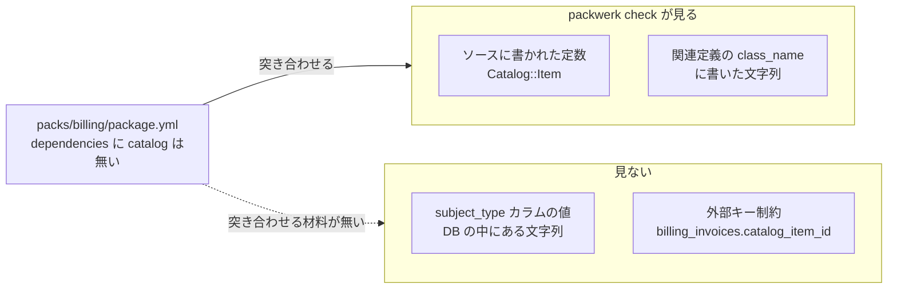
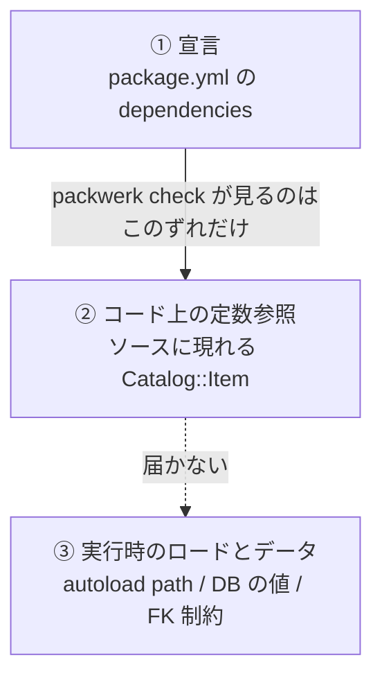

Shopify Engineering の「[A Packwerk Retrospective](https://shopify.engineering/a-packwerk-retrospective)」（2024-02-07）は、自社で作った Packwerk を数年運用した後の振り返りです。その「悪かった点」の4つ目に、こう書かれています。

> パッケージを実際に分離して動かしてみると、Packwerk が見逃していた違反が出てきた

**再現手順も具体例も書かれていません。** どういう書き方をすると見逃されるのか、そのとき何が壊れるのかが分からないと、自分のアプリの `No offenses detected` をどう読めばいいかも決められません。

そこで最小構成の Rails アプリを作って、手元で再現しました。この記事でやることは3つです。

1. `packwerk check` が**見る依存と見ない依存**を、4通りの書き方で並べて測る
2. **違反ゼロのまま**パッケージをロードから外し、実際に壊れることを確かめる
3. 同じアプリで **Rails Engine** と比べ、「Engine のほうが強い」の中身が何なのかを測る

## この記事で書くこと・書かないこと

**書くこと**は、上の3点と、`packwerk check` が `package.yml` の設定不備を素通りすることの実測です。すべて手元で動かした出力を原文で貼ります。

**書かないこと**を先に挙げておきます。

- **packwerk の導入手順・運用のベストプラクティス**。既存アプリへの入れ方や `package_todo.yml` の潰し方は扱いません
- **`packwerk-extensions`（別 gem）の挙動**。`enforce_privacy` などが本体から外れて別 gem にあるとされていますが、**そちらは確かめていません**
- **大規模アプリでの実績**。この記事の測定はすべて、2パッケージだけの最小構成です
- **packwerk と他のツール（rubocop-packs、pks など）の比較**

また、この記事は「packwerk を使うな」という話ではありません。**測っているのは、あるツールが定義上どこまでを見る道具なのか**であって、そのツールの良し悪しではありません。

## 検証環境

| 項目 | 値 |
| --- | --- |
| OS | macOS (arm64) |
| Ruby | 4.0.6 |
| Rails | 8.1.3.1 |
| packwerk | 3.3.1 |
| DB | SQLite |
| 検証日 | 2026-08-28 |

コードは [zenn-examples/packwerk-zero-violations-not-separable](https://github.com/y-sakamoto-lu-llc/zenn-examples/tree/8f9602003d37e3de456f5255fe2e8f180a36f439/packwerk-zero-violations-not-separable) にあります。

先に確認しておいたことが1つあります。**packwerk 3.3.1 の runtime dependencies には上限が一つもありません**（`activesupport >= 6.0`、`zeitwerk >= 2.6.1`、`constant_resolver >= 0.3`、他は `>= 0`）。`required_ruby_version` は `>= 3.3` です。

上限が無いことは Rails 8.1 で動く証拠にはならないので、まず `packwerk init` / `packwerk validate` / `packwerk check` が一通り動くことを確認してから測定に入りました。結果は問題なく動いています。

## 結論

先に結論を4つ書きます。

**1. `packwerk check` は「`package.yml` の宣言」と「コードに書かれた定数参照」のずれだけを見る道具です。** 境界が正しいことの証明にも、設定が効いていることの証明にもなりません。

**2. 見えないのは polymorphic 関連と DB スキーマ由来の依存です。** どちらも Rails では普通の書き方であって、境界を隠すための細工ではありません。**静的解析の実装の穴ではなく、定義上の限界**です。

**3. CI で `check` だけを回していると、そのパッケージの依存検査が丸ごと無効になっていても緑になります。** `packwerk validate` を必ず並べてください。

**4. 境界が本当に切れているかを知りたいなら、実際に切り離して動かす以外の方法がありません。**

packwerk の視界を図にするとこうなります。



## 測定に使ったアプリ

パッケージは2つです。`packs/catalog` に `Catalog::Item`（`catalog_items` テーブル）、`packs/billing` に `Billing::Invoice`（`billing_invoices` テーブル）を置きます。

`config/application.rb` で `packs/*/app/*` を autoload root にしています。あわせて、あとで catalog だけをロードから外せるように環境変数で分岐させています。

```ruby
# config/application.rb
Dir.glob(Rails.root.join("packs/*/app/*")).each do |path|
  next if ENV["SEPARATE_CATALOG"] == "1" && path.include?("packs/catalog")

  config.autoload_paths << path
  config.eager_load_paths << path
end
```

`SEPARATE_CATALOG=1` を付けると `packs/catalog` が autoload path から消えます。これが「実際に分離する」操作にあたります。

そして本題の宣言です。`packs/billing/package.yml` は、**catalog に依存しないと明示しています**。

```yaml
# packs/billing/package.yml
enforce_dependencies: true
dependencies:
  - "."   # ApplicationRecord はルートパッケージにある
```

`"."` を書いているのは、書かないと `ApplicationRecord` への違反が2件出てノイズになるからです。**catalog は依存に入っていません。** この記事の測定は全部、この宣言に対して billing → catalog の依存を作ったらどうなるか、という形をとります。

## 測定1：何が見えて、何が見えないか

billing から catalog への依存を4通りの書き方で作り、それぞれ `bundle exec packwerk check` を回しました。結果です。

| billing → catalog の書き方 | `packwerk check` |
| --- | --- |
| 定数を直接書く（`Catalog::Item.find(id)`） | **検出する** |
| `belongs_to :catalog_item, class_name: "Catalog::Item"` | **検出する** |
| `belongs_to :subject, polymorphic: true` ＋ `subject_type.constantize` | **見えない** |
| `billing_invoices.catalog_item_id` の外部キー制約 | **見えない** |

検出されたときの出力はこれです（原文）。

```
packs/billing/app/models/billing/invoice.rb:7:6
Dependency violation: ::Catalog::Item belongs to 'packs/catalog', but 'packs/billing' does not specify a dependency on 'packs/catalog'.
Are the constant and its references in the right packages?

Inference details: this is a reference to ::Catalog::Item which seems to be defined in packs/catalog/app/models/catalog/item.rb.
To receive help interpreting or resolving this error message, see: https://github.com/Shopify/packwerk/blob/main/TROUBLESHOOT.md#Troubleshooting-violations
```

参照元のファイルと行、参照先の定数、その定数がどのパッケージのどのファイルで定義されていると推論したかまで出ます。**見えている依存についての報告は、かなり親切です。**

### 「文字列にすれば逃げられる」ではない

意外だったのは2行目です。`class_name: "Catalog::Item"` は**文字列**ですが、これは検出されました。packwerk は Active Record の関連定義を解析対象に含んでいます。

つまり**盲点の境目は「文字列で書いたかどうか」ではありません。** 境目はここです。

**その文字列がコードの中にあるか、それとも DB の値として存在するか。**

`class_name: "Catalog::Item"` はソースを読めば `Catalog::Item` という語が見つかります。一方 polymorphic 関連の `subject_type` に入る `"Catalog::Item"` は、**ソースのどこにも現れません**。行が存在するときにだけ、DB のカラムの中に文字列として入っています。静的解析はファイルを読む道具なので、後者は原理的に見えません。

「文字列で書けば packwerk を黙らせられる」と読むと逆方向の誤解になります。黙るのは、参照先の名前が**実行時にしか決まらない**ときです。

### 違反ゼロになる最終形

4通りのうち、見えない書き方だけを残したのがこの `Billing::Invoice` です。

```ruby
module Billing
  class Invoice < ApplicationRecord
    self.table_name = "billing_invoices"

    # 参照先のクラス名は DB の subject_type カラムに入っていて、コードには現れない
    belongs_to :subject, polymorphic: true

    def subject_name
      subject_type.constantize.find(subject_id).name
    end
  end
end
```

`subject_type` カラムには文字列 `"Catalog::Item"` が入ります。**このファイルのどこにも `Catalog` という語がありません。** 加えて `billing_invoices` には `catalog_items` への外部キー制約が残っています。

繰り返しますが、これは packwerk を騙すために書いたコードではありません。**polymorphic 関連は Rails の標準機能で、普通に使われる書き方**です。それがそのまま盲点になっています。

## 測定2：違反ゼロの状態で分離すると壊れる

この状態で `packwerk check` を回します（原文）。

```
📦 Packwerk is inspecting 25 files
.........................
📦 Finished in 0.34 seconds

No offenses detected
No stale violations detected
```

**違反ゼロです。** `package_todo.yml` に溜まった古い違反もありません。この表示だけを見れば、billing は catalog に依存していないように読めます。

では、実際に分離します。`SEPARATE_CATALOG=1` を付けて `packs/catalog` を autoload path から外し、4つの検査をかけました。

| 検査 | 結果 |
| --- | --- |
| `bundle exec packwerk check` | `No offenses detected` |
| `bin/rails zeitwerk:check` | `All is good!` |
| `Rails.application.eager_load!` | 通る（アプリは起動できる） |
| 実際にコードを実行 | **5項目中4項目が失敗** |

上の3つが全部通ることに注意してください。静的解析も、zeitwerk の整合性チェックも、eager load も、何も言いません。**アプリは起動します。**

実行時の出力です（原文）。

```
SEPARATE_CATALOG=1
autoload_paths に packs/catalog を含む: false

FAIL | Catalog::Item を作る | NameError: uninitialized constant Catalog
FAIL | Billing::Invoice を作る (subject_type に Catalog::Item が入る) | NameError: uninitialized constant Catalog
FAIL | invoice.subject (polymorphic 関連をたどる) | NameError: uninitialized constant Catalog
FAIL | invoice.subject_name (subject_type.constantize) | NameError: uninitialized constant Catalog
OK   | FK 制約: 参照中の catalog_items が消せないこと
5 項目中 4 件が失敗
```

catalog を外していない状態では、同じスクリプトが「5 項目中 0 件が失敗」になります。**壊れているのは分離した状態だけ**です。

### 最後の1行が示していること

5項目目の `OK` は、「消せないこと」を確認した項目です。`billing_invoices` から参照されている限り、`catalog_items` の行は削除できず `ActiveRecord::InvalidForeignKey` になります。この挙動は、catalog を Ruby のロードから外しても変わりません。

**コードを切り離しても、データの結合は残ります。** 当たり前のことですが、静的解析の結果には一切現れません。外部キー制約は DB スキーマにあって、Ruby のソースには無いからです。

境界を3層に分けると、`packwerk check` が扱う範囲がはっきりします。



`packwerk check` は①と②のずれを見ます。③は見ません。そして**分離したときに壊れるのは③**です。

## 測定3：Rails Engine と比べると何が違うのか

「Packwerk で継ぎ目を見つけて、切れそうなところを Engine に昇格させる」という進め方があります。では Engine にすると何が強くなるのか。

David Silva「[The Modular Monolith in Rails: Engines, Packwerk & Boundaries](https://davidslv.uk/modular-monolith-rails/)」（最終更新 2026年6月）は Engine についてこう書いています。

> The boundary isn't only a convention you have to remember — much of it is wired into how Rails loads and mounts the engine.

この "wired into" が実際に何を止めるのかを、同じアプリで測りました。`rails plugin new engines/catalog_engine --mountable` で作った engine に `CatalogEngine::Item` を置き、Gemfile に追加します。

```ruby
gem "catalog_engine", path: "engines/catalog_engine", require: false
```

pack と engine を並べた結果です。

| 操作 | Packwerk の pack | Rails Engine |
| --- | --- | --- |
| 境界をまたぐ定数参照を `packwerk check` が見る | 見る（定数を直接書いた場合） | **見ない**（gem は解析対象外） |
| ロードから外す | 起動する / 実行時 `NameError` | 起動する / 実行時 `NameError` |
| 依存の宣言から外す | `package.yml` は起動に関係しない | **起動時に `LoadError`** |

真ん中の行は**同じ**です。ロードから外したときの壊れ方に差はありません。差が出るのは3行目です。Engine を Gemfile から外して `bundle install` した後の起動がこれです（原文）。

```
/Users/.../lib/ruby/4.0.0/bundled_gems.rb:60:in 'Kernel.require': cannot load such file -- catalog_engine (LoadError)
```

**起動しません。** 一方 `package.yml` の `dependencies` から行を消しても、アプリは何事もなく起動します。`package.yml` は起動に一切関与しないファイルだからです。

### Engine の「強さ」の出どころ

ここで1つ確かめておきたいことがありました。Engine の強さは `isolate_namespace` による名前空間の分離から来ているのか、という点です。

`isolate_namespace` を付けた engine の `CatalogEngine::Item` を、billing から**定数で直接**参照してみました。`packwerk check` は**違反ゼロ**です。gem は packwerk の解析対象に入らないので、参照が見えません。

つまり**Engine の「強さ」は名前空間の分離ではなく、依存が Gemfile に書かれることから来ています。** Gemfile は起動時に評価されるファイルなので、宣言と実行が同じ経路に乗ります。`package.yml` にはそれがありません。

そして裏返しがあります。**Engine 化した瞬間、そのコードは packwerk の視界から消えます。** 「Packwerk で継ぎ目を見つけて Engines に昇格させる」という順序をとるなら、昇格した部分の依存監視を失うことと引き換えになります。

:::message
細かい観測として、engine を `require` しない状態でも `CatalogEngine` モジュール自体は定義済みになります（持っている定数は `VERSION` だけ）。path 指定の gem は、gemspec が bundler に評価される際に `catalog_engine/version` を読むためです。ただし Engine は `Rails::Engine.subclasses` に登録されず、`app/models` も autoload path に入らないので、`CatalogEngine::Item` は解決できません。
:::

## 測定4：check は設定の不備を見ない

もう1つ、CI の組み方に直結する挙動があります。`package.yml` に本体が知らないキーを書いたときの振る舞いです。

| `package.yml` に書いたもの | `packwerk validate` | `packwerk check` |
| --- | --- | --- |
| `enforce_dependency: true`（`s` が抜けたタイポ） | `Unknown keys: ["enforce_dependency"]` | `No offenses detected` |
| `enforce_privacy: true` | `Unknown keys: ["enforce_privacy"]` | `No offenses detected` |

`validate` の出力です（原文）。

```
Validation failed ❗

❓ Malformed syntax in the following manifests:

	Unknown keys: ["enforce_dependency"] in "/path/to/packs/billing/package.yml"
```

`validate` は落とします。`check` は素通りします。

**`enforce_dependencies` を `enforce_dependency` と打ち間違えると、そのパッケージの依存検査は丸ごと無効になります。** それでも `check` は `No offenses detected` を返します。CI で `check` だけを回している構成では、検査が効いていないことに気づく手段がありません。

対処は単純で、**CI に `validate` を必ず並べる**ことです。

```sh
bundle exec packwerk validate
bundle exec packwerk check
```

### enforce_privacy が拒否される理由

2行目の `enforce_privacy` はタイポではありません。かつて packwerk にあった機能です。これが 3.3.1 で `Unknown keys` になるのは、**この機能が packwerk 本体から外れているため**です。

冒頭の Shopify の振り返りでは、悪かった点の1つ目として「privacy チェックが Rails の規約を壊し、かえって設計上の問題を生んだ」と総括されています。機能が本体から外れたこと自体が、その総括と地続きに見えます。

なお `enforce_privacy` は別 gem の `packwerk-extensions` にあるとされていますが、**この記事では確かめていません**（後述）。

## この記事の測定が示していること

Shopify の振り返りには、もう1つ根本的な指摘があります。

> developers tend to group code into packages based strongly on semantic clues that in many cases have little relation to how the code actually runs.
>
> （開発者は意味的な手がかりでコードをパッケージに分けるが、それは実際の動き方とほとんど関係がない）

測定2で起きたのは、まさにこれでした。`packs/billing` と `packs/catalog` という**名前の上の分割**は成立しています。`package.yml` の宣言も、コードに書かれた定数参照も、互いに矛盾していません。それでも、実際に走らせると billing は catalog 無しには動きません。

**「意味の上での分割」と「実際の動き方」がずれていて、`packwerk check` はそのずれを見る位置に居ない**、ということです。

だから `No offenses detected` の読み方はこうなります。

- 読めること — **ソースに書かれた定数参照の範囲では、宣言と矛盾していない**
- 読めないこと — 境界が正しいこと、設定が効いていること、分離できること

## 自分では確かめていないこと

- **`packwerk-extensions`（別 gem）の挙動**。`enforce_privacy` がこちらに移ったとされていますが、入れて動かしていません。「本体から外れている」ことだけが測定の範囲です
- **大規模アプリでの挙動**。この記事の構成は2パッケージ・25ファイルです。ファイル数が増えたときの検出漏れの傾向や実行時間は測っていません
- **polymorphic 以外の動的参照**。`const_get`、`send`、`Object.const_get` を経由した参照、STI の `type` カラム、`serialize` の型指定などは試していません。**見えないだろうと推測はできますが、測っていないので断定しません**
- **`packwerk check` 以外のコマンドの網羅**。`update-todo` / `check --parallel` などは触っていません
- **Engine を実際に別リポジトリの gem として切り出した場合**。今回の Engine は `path:` 指定のローカル gem です
- **CI での実運用**。`validate` を並べる話は挙動の測定から導いたもので、実際の CI で運用した結果ではありません

## まとめ

- **`packwerk check` の `No offenses detected` は、境界の正しさの証明ではありません。** 見ているのは「`package.yml` の宣言」と「ソースに書かれた定数参照」のずれだけです
- **見えないのは polymorphic 関連と DB スキーマ由来の依存。** どちらも Rails では普通の書き方で、静的解析の実装の穴ではなく定義上の限界です
- **盲点の境目は「文字列で書いたかどうか」ではありません。** `class_name: "Catalog::Item"` は検出されます。境目は、その名前がソースにあるか、DB の値としてしか存在しないかです
- **違反ゼロのまま分離すると壊れます。** 今回の構成では `packwerk check` も `zeitwerk:check` も `eager_load!` も通り、実行して初めて5項目中4項目が失敗しました
- **コードを切り離してもデータの結合は残ります。** 外部キー制約は静的解析の結果に一切現れません
- **CI には `validate` を必ず並べてください。** `enforce_dependencies` のタイポで検査が丸ごと無効になっても、`check` は緑を返します
- **Engine の強さは名前空間ではなく Gemfile から来ています。** そして Engine 化した部分は packwerk の視界から消えます

境界が本当に切れているかを知りたいなら、**実際に切り離して動かす**以外の方法がありません。今回それをやったのは環境変数1つで autoload path を落とすだけの、20行に満たない仕掛けです。CI に1本だけ「分離して起動して主要な経路を叩く」ジョブを置けるなら、静的解析が構造上見られないものを見に行けます。

## 参考

- [A Packwerk Retrospective — Shopify Engineering](https://shopify.engineering/a-packwerk-retrospective)（2024-02-07）
- [Shopify/packwerk — GitHub](https://github.com/Shopify/packwerk)
- [TROUBLESHOOT.md — Shopify/packwerk](https://github.com/Shopify/packwerk/blob/main/TROUBLESHOOT.md)
- [The Modular Monolith in Rails: Engines, Packwerk & Boundaries — David Silva](https://davidslv.uk/modular-monolith-rails/)
- [zenn-examples/packwerk-zero-violations-not-separable](https://github.com/y-sakamoto-lu-llc/zenn-examples/tree/8f9602003d37e3de456f5255fe2e8f180a36f439/packwerk-zero-violations-not-separable)
