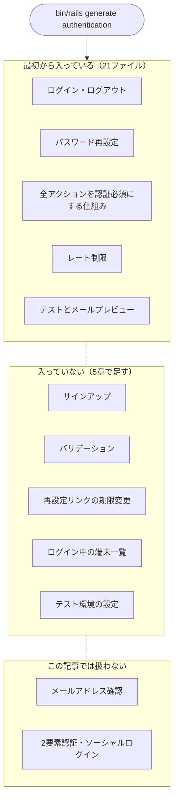
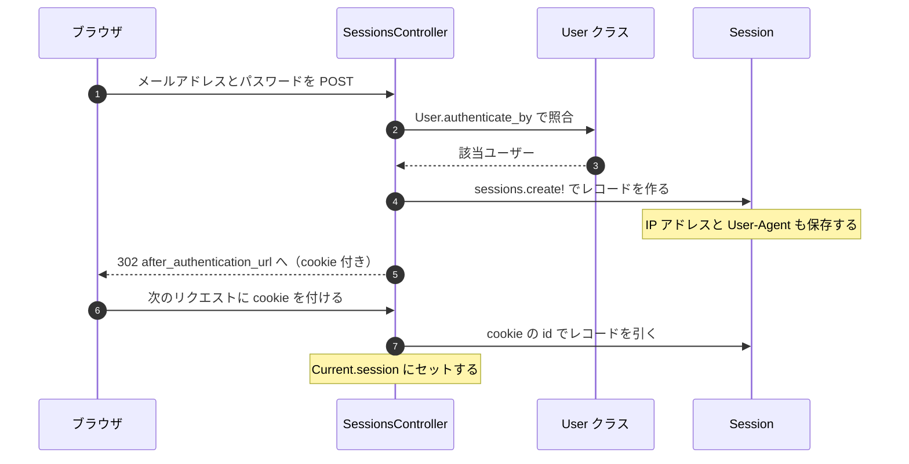
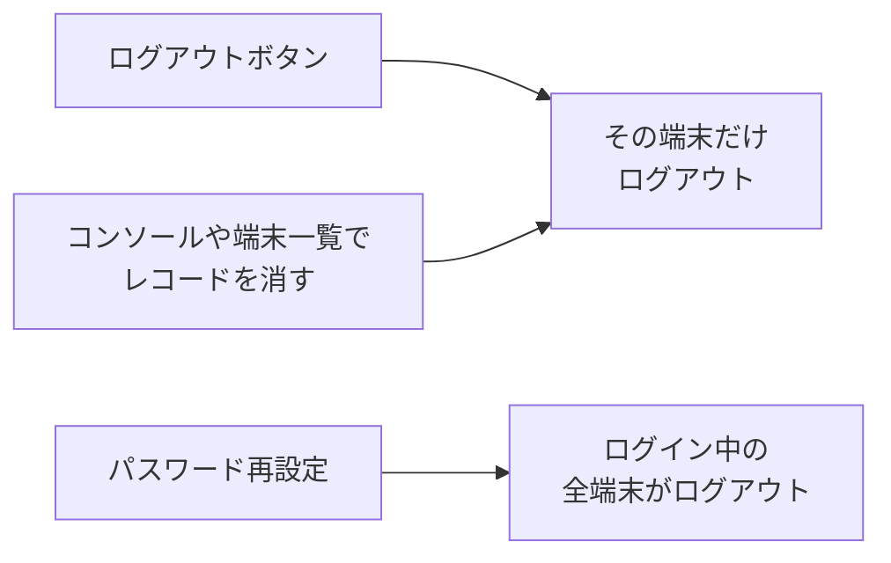
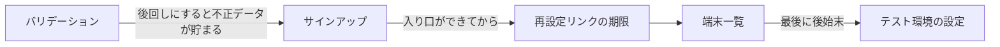

Rails 8 から、`bin/rails generate authentication` というコマンドで認証の土台が作れるようになりました。gem を入れるのではなく、**自分のアプリのファイルとしてコードが吐き出される**のが特徴です。Devise のようにブラックボックスの中で動くのではなく、生成されたコードを読んで、必要なら書き換えて使います。

この記事では Rails 8.1 で実際にアプリを作り、生成された21ファイルを全部読んで、動かして確かめた結果をまとめます。**どこまでが最初から入っていて、どこからは自分で書くのか**を、実際の出力とテストで示します。

## 検証環境

| 項目 | 値 |
| --- | --- |
| OS | macOS 26.3.1 (arm64) |
| Ruby | 3.4.10 |
| Rails | 8.1.3.1 |
| テストフレームワーク | minitest（`rails new` の既定） |
| 検証日 | 2026-08-23 |

Rails のバージョンが2つ出てくるので先に整理しておきます。`rails _8.1.3_ new` で呼ぶのは**手元に入れた rails コマンドのバージョン**で、それが生成する Gemfile は `gem "rails", "~> 8.1.3"` です。`bundle install` で解決される実体が **8.1.3.1** で、アプリが実際に動かしているのはこちらです。

テストフレームワークを書いているのには理由があります。ジェネレータの最終行は `hook_for :test_framework` で、テスト関連のファイルは**使っているテストフレームワークのフックに委ねられます**。rspec-rails を入れた環境では、後述するテスト6ファイルは生成されません（アプリ本体の15ファイルだけになります）。

この記事に貼っているコマンドの出力・テストの結果は、すべてこの環境で実行したものです。コードは [zenn-examples/rails81-authentication-generator](https://github.com/y-sakamoto-lu-llc/zenn-examples/tree/4845ae7dc16a8a6734bf99923e9b8452f1c3445d/rails81-authentication-generator) にあります。

## この記事で書くこと・書かないこと

認証は範囲を決めずに書くと際限がないので、最初に線を引いておきます。

**書くこと**

| 内容 | どこまで |
| --- | --- |
| 導入手順 | `rails new` から、ブラウザでログインできるまで |
| 生成された21ファイルの読み方 | 全ファイルの役割と、認証が成立する仕組み |
| デフォルトで守ってくれるもの | レート制限、タイミング攻撃対策、cookie の属性 |
| デフォルトで守ってくれないもの | バリデーション不在、サインアップ不在、テスト環境でのレート制限無効 |
| 拡張のしかた | 手元で実際に動かして確かめた4つだけ |

**書かないこと**

| 内容 | 理由 |
| --- | --- |
| Devise との比較・移行 | 主題は Rails 8.1 の導入。比較は別の記事に分けます |
| Rails 8.0 との差分 | 効いてくる3箇所でだけ触れます |
| メールアドレス確認、2要素認証、ソーシャルログイン | **試していません。** 公式ガイドへのリンクだけ置きます |
| 本番環境での挙動 | `force_ssl` 下の cookie、分散キャッシュでのレート制限は**試していません** |
| JWT / トークン認証 | ジェネレータには `--api` オプションがあり、ビュー抜きでも生成できます。ただし**認証方式は cookie セッションのまま**なので、トークン認証の話は扱いません |
| 画面のデザイン | 生成されるビューは素の HTML です |

**想定読者**は、Rails のチュートリアルを終えて `before_action` と `has_many` が読める人です。認証を自作した経験は前提にしません。

## 全体像

先に地図を出します。この記事は上から順に、3つのブロックを見ていきます。



## 1. 導入する

### 4つのコマンドで入る

```sh
rails _8.1.3_ new authgen
cd authgen
bin/rails generate authentication
bin/rails db:migrate
```

`bin/rails generate authentication` の出力がこれです。

```
      invoke  erb
      create    app/views/passwords/new.html.erb
      create    app/views/passwords/edit.html.erb
      create    app/views/sessions/new.html.erb
      create  app/models/session.rb
      create  app/models/user.rb
      create  app/models/current.rb
      create  app/controllers/sessions_controller.rb
      create  app/controllers/concerns/authentication.rb
      create  app/controllers/passwords_controller.rb
      create  app/channels/application_cable/connection.rb
      create  app/mailers/passwords_mailer.rb
      create  app/views/passwords_mailer/reset.html.erb
      create  app/views/passwords_mailer/reset.text.erb
      insert  app/controllers/application_controller.rb
       route  resources :passwords, param: :token
       route  resource :session
        gsub  Gemfile
         run  bundle install --quiet
    generate  migration
       rails  generate migration CreateUsers email_address:string!:uniq password_digest:string! --force
      invoke  active_record
      create    db/migrate/20260823030938_create_users.rb
    generate  migration
       rails  generate migration CreateSessions user:references ip_address:string user_agent:string --force
      invoke  active_record
      create    db/migrate/20260823030939_create_sessions.rb
      invoke  test_unit
      create    test/fixtures/users.yml
      create    test/models/user_test.rb
      create    test/controllers/sessions_controller_test.rb
      create    test/controllers/passwords_controller_test.rb
      create    test/mailers/previews/passwords_mailer_preview.rb
      create    test/test_helpers/session_test_helper.rb
      insert    test/test_helper.rb
```

`create` が21個、既存ファイルへの `insert` が2箇所、ルートが2行です。

`gsub Gemfile` は bcrypt の有効化です。追記ではなく、`rails new` が**コメントアウトした状態で置いていた行の `#` を外します**（ジェネレータのソースでは `uncomment_lines "Gemfile", /gem "bcrypt"/`）。Gemfile の末尾を探しても見つからないので注意してください。

```ruby
# 変更前（rails new が置いた状態）
# gem "bcrypt", "~> 3.1.7"

# 変更後
gem "bcrypt", "~> 3.1.7"
```

### 生成される21ファイルを地図にする

```
app/
├── models/
│   ├── user.rb                              6行   has_secure_password
│   ├── session.rb                           3行   belongs_to :user だけ
│   └── current.rb                           4行   Current.user を提供する
├── controllers/
│   ├── concerns/authentication.rb          52行   ★認証ロジック本体
│   ├── sessions_controller.rb              21行   ログイン・ログアウト
│   └── passwords_controller.rb             35行   パスワード再設定
├── channels/application_cable/
│   └── connection.rb                       16行   Action Cable 側の認証
├── mailers/
│   └── passwords_mailer.rb                  6行
└── views/
    ├── sessions/new.html.erb               11行   ログインフォーム
    ├── passwords/new.html.erb               8行   再設定の申し込み
    ├── passwords/edit.html.erb              9行   新しいパスワードの入力
    ├── passwords_mailer/reset.html.erb      6行   メール本文（HTML）
    └── passwords_mailer/reset.text.erb      4行   メール本文（テキスト）
db/migrate/
├── ..._create_users.rb                     11行
└── ..._create_sessions.rb                  11行
test/
├── fixtures/users.yml                       9行
├── models/user_test.rb                      8行
├── controllers/sessions_controller_test.rb 33行
├── controllers/passwords_controller_test.rb 67行
├── mailers/previews/passwords_mailer_preview.rb  7行
└── test_helpers/session_test_helper.rb     19行
```

アプリ本体が15ファイル203行、テストが6ファイル143行、合わせて **21ファイル346行**です。認証ロジックの本体は `app/controllers/concerns/authentication.rb` の52行で、ここだけ読めば仕組みは分かります（2章で全文を載せます）。

なお `application_cable/connection.rb` は Action Cable が、メール関連は Action Mailer が有効なときだけ生成されます。`rails new` に `--skip-action-cable` などを付けていると、ファイル数はこれより減ります。

### root を決めるまで、生成されたテストは通らない

生成された時点でテストも一緒に作られているので、そのまま走らせてみます。

```sh
bin/rails test
```

```
Error:
SessionsControllerTest#test_create_with_valid_credentials:
NameError: undefined local variable or method 'root_url' for an instance of SessionsController
    app/controllers/concerns/authentication.rb:38:in 'Authentication#after_authentication_url'

12 runs, 44 assertions, 0 failures, 1 errors, 0 skips
```

**1件落ちます。** ログイン成功後の飛び先を決める `after_authentication_url` が `root_url` を呼ぶのに、`rails new` 直後は root ルートが無いためです。

```ruby
# app/controllers/concerns/authentication.rb
def after_authentication_url
  session.delete(:return_to_after_authenticating) || root_url
end
```

root を決めれば通ります。

```ruby
# config/routes.rb
root "home#index"
```

```
12 runs, 48 assertions, 0 failures, 0 errors, 0 skips
```

:::message alert
**テストが通っても、まだブラウザでは動きません。** ここが引っかかりやすいところです。テストが見ているのは「`root_path` という URL が生成できるか」だけで、その先のコントローラを呼びません。ルートだけ書いた状態でログインすると、リダイレクト先で例外になります。

```
ActionDispatch::MissingController: uninitialized constant HomeController
```
:::

コントローラとビューも作ります。ビューの中身は3章で説明する `authenticated?` ヘルパーの例をそのまま使っています。

```ruby
# app/controllers/home_controller.rb
class HomeController < ApplicationController
  def index
  end
end
```

```erb
<%# app/views/home/index.html.erb %>
<h1>ホーム</h1>

<% if authenticated? %>
  <p><%= Current.user.email_address %> でログイン中</p>
  <%= button_to "ログアウト", session_path, method: :delete %>
<% else %>
  <p><%= link_to "ログイン", new_session_path %></p>
<% end %>
```

ログアウトのリンクは生成されないので、こうして自分で置く必要があります。認証を入れるときは **root ルート・コントローラ・ビューの3点セット**を先に用意する、と覚えておくと詰まりません。

### 最初のユーザーは console で作る

ここが最初の関門です。**サインアップの画面は生成されません。** ログインフォームはありますが、アカウントを作る手段がないので、最初の1人はコンソールから入れます（まともなサインアップ画面は5章で足します）。

```sh
bin/rails console
```

```ruby
User.create!(email_address: "alice@example.com", password: "secret123")
```

```
#<User:0x000000012a3b4c58
 id: 1,
 email_address: "[FILTERED]",
 password_digest: "[FILTERED]",
 created_at: "2026-08-23 03:19:11.529221000 +0000",
 updated_at: "2026-08-23 03:19:11.529221000 +0000">
```

`email_address` が `[FILTERED]` になっているのは、`rails new` が作る `config/initializers/filter_parameter_logging.rb` に `:email` が入っているからです。ログにメールアドレスが残りません。

あとは `bin/rails server` を起動して `/session/new` を開けばログインできます。

## 2. 認証はどう動いているか

### この先に出てくる出力について

この章から先、次のような形式の出力が何度も出てきます。

```
[削除前に root] 200
[削除後に root] 302 -> http://www.example.com/session/new
```

これは `bin/rails test` の出力ではありません。**記事のために書いた検証用のテストの中で `puts` した結果**です。サンプルリポジトリの `test/integration/` と `test/models/` に26件置いてあり、たとえば上の出力はこう書いています。

```ruby
# test/integration/authentication_flow_test.rb
test "セッションレコードを消すと即ログアウト" do
  post session_path, params: { email_address: @user.email_address, password: "password" }
  get root_path
  puts "[削除前に root] #{response.status}"
  Session.order(:created_at).last.destroy
  get root_path
  puts "[削除後に root] #{response.status} -> #{response.headers['Location']}"
end
```

生成されたテストとは別物なので、記事どおりに手を動かしている読者の手元では、これらの出力は出ません。自分でも確かめたい場合はリポジトリのテストを見てください。

### 認証ロジックはこの52行だけ

先に全文を出します。この記事で一番重要なファイルです。

```ruby
# app/controllers/concerns/authentication.rb
module Authentication
  extend ActiveSupport::Concern

  included do
    before_action :require_authentication
    helper_method :authenticated?
  end

  class_methods do
    def allow_unauthenticated_access(**options)
      skip_before_action :require_authentication, **options
    end
  end

  private
    def authenticated?
      resume_session
    end

    def require_authentication
      resume_session || request_authentication
    end

    def resume_session
      Current.session ||= find_session_by_cookie
    end

    def find_session_by_cookie
      Session.find_by(id: cookies.signed[:session_id]) if cookies.signed[:session_id]
    end

    def request_authentication
      session[:return_to_after_authenticating] = request.url
      redirect_to new_session_path
    end

    def after_authentication_url
      session.delete(:return_to_after_authenticating) || root_url
    end

    def start_new_session_for(user)
      user.sessions.create!(user_agent: request.user_agent, ip_address: request.remote_ip).tap do |session|
        Current.session = session
        cookies.signed.permanent[:session_id] = { value: session.id, httponly: true, same_site: :lax }
      end
    end

    def terminate_session
      Current.session.destroy
      cookies.delete(:session_id)
    end
end
```

読みどころは3つです。

- `included do` の `before_action :require_authentication` — これが `ApplicationController` に差し込まれるので、**何も書かなければ全アクションが認証必須**になります
- `allow_unauthenticated_access` の正体は `skip_before_action` — 新しい仕組みではなく、いつもの `before_action` のスキップです
- `start_new_session_for` と `terminate_session` — ログインとログアウトが、それぞれ「DB のレコードを作る／消す」だけで表現されています

以降の節はこの52行を分解して見ていきます。

### ログインから次のリクエストまで

ログインボタンを押してから、次のページが認証済みで開くまでの流れです。`User` はクラス（`User.authenticate_by` はクラスメソッド）を指しています。



### cookie に入っているのは session.id そのもの

ここは誤解しやすいところです。**セッションを識別するためのトークン用カラムはありません。**

```ruby
# db/schema.rb
create_table "sessions", force: :cascade do |t|
  t.datetime "created_at", null: false
  t.string "ip_address"
  t.datetime "updated_at", null: false
  t.string "user_agent"
  t.integer "user_id", null: false
  t.index ["user_id"], name: "index_sessions_on_user_id"
end
```

`token` カラムも `has_secure_token` もありません。cookie に入るのはレコードの `id` そのもので、改竄は Rails の署名付き cookie が防いでいます。署名は**アプリの `secret_key_base` を鍵にした HMAC** で、値を書き換えると検証に失敗して `cookies.signed[:session_id]` は `nil` を返します。

テストで実際の `Set-Cookie` を見ると、こうなっています。

```
session_id=eyJfcmFpbHMiOnsibWVzc2FnZSI6Ik1RPT0iLCJleHAiOiIyMDQ2LTA4LTIzVDAzOjExOjUzLjQ3NFoiLCJwdXIiOiJjb29raWUuc2Vzc2lvbl9pZCJ9fQ%3D%3D--435c6da0a00a4abecd93bf5d3f337d7f6499e9c5; path=/; expires=Thu, 23 Aug 2046 03:11:53 GMT; httponly; samesite=lax
```

`--` の後ろが署名です。前半は Base64 なので、こうすると中身が読めます。

```ruby
require "base64"
payload = JSON.parse(Base64.decode64(CGI.unescape(raw[/session_id=([^;]+)/, 1]).split("--").first))
# => {"_rails" => {"message" => "MQ==", "exp" => "2046-08-23T03:11:53.474Z", "pur" => "cookie.session_id"}}
Base64.decode64(payload["_rails"]["message"])  # => "1"
```

`MQ==` をさらにデコードすると `1`、つまり `Session` レコードの id です。

属性とコードの対応はこうなっています。

```ruby
cookies.signed.permanent[:session_id] = { value: session.id, httponly: true, same_site: :lax }
#       ^^^^^^ 署名   ^^^^^^^^^ 有効期限20年              ^^^^^^^^^^^^^^  ^^^^^^^^^^^^^^^^^
#                                                        JS から読めない   他サイトからの POST に付かない
```

`secure`（HTTPS 限定）は付いていないので、そこは `config.force_ssl` 側の担当になります。本番でどうなるかは試していません。

### セッションが消える3つの経路

セッションの実体が DB のレコードなので、**レコードが消えればその端末は即座にログアウト**になります。消し方は3通りあり、消える範囲がそれぞれ違います。



**ログアウトボタン**は `terminate_session` で、自分のレコードを1件消して cookie を削除します。ふつうのログアウトです。

**レコードを直接消す**のは、管理画面やコンソールから `Session` のレコードを削除する場合です。cookie を持っている端末は何も知らないまま、次のリクエストでログイン画面に飛ばされます。5章で作る端末一覧は、この経路をユーザー自身に開放したものです。

```
[削除前に root] 200
[削除後に root] 302 -> http://www.example.com/session/new
```

**パスワード再設定**だけは全端末が対象です。効いてくるのは「パスワードを乗っ取られたので変更する」場面で、Rails 8.1 の `PasswordsController#update` は再設定に成功すると `@user.sessions.destroy_all` を呼ぶため、攻撃者のセッションも一緒に消えます。ここは 8.0 には無かった処理なので、8.0 のまま使うなら `PasswordsController#update` の成功時に同じ1行を自分で足しておくと安全です。

### Current.user はどこから来るのか

`Current.user` は3つのファイルを経由して組み立てられます。

```ruby
# app/models/current.rb
class Current < ActiveSupport::CurrentAttributes
  attribute :session
  delegate :user, to: :session, allow_nil: true
end
```

```ruby
# app/controllers/concerns/authentication.rb
def resume_session
  Current.session ||= find_session_by_cookie
end

def find_session_by_cookie
  Session.find_by(id: cookies.signed[:session_id]) if cookies.signed[:session_id]
end
```

cookie から `Session` を引いて `Current.session` に入れ、`Current.user` はそこへ委譲しているだけです。

グローバル変数のように見えて不安になるところですが、`ActiveSupport::CurrentAttributes` の値は**スレッド（＝処理中のリクエスト）ごとに隔離**されていて、リクエストが終わると必ずリセットされます。別のリクエストのユーザーが混ざることはありません。

## 3. デフォルトでできること

### 何もしなければ全アクションが認証必須

前述のとおり `before_action :require_authentication` が `ApplicationController` に差し込まれるので、**何も書かなければ全部のアクションが認証必須**です。公開したいところだけ開ける形になります。

試すために記事や商品に相当するコントローラを1つ作ります。

```ruby
# app/controllers/articles_controller.rb
class ArticlesController < ApplicationController
  allow_unauthenticated_access only: [:index, :show]

  def index
  end

  def show
  end

  def new
  end
end
```

```ruby
# config/routes.rb
resources :articles, only: [:index, :show, :new]
```

ビューは `app/views/articles/` に `index.html.erb` / `show.html.erb` / `new.html.erb` を置きます。中身は `<h1>articles#index</h1>` のような1行で構いません。

未認証で叩いた結果です。

```
[未認証 articles#index] 200
[未認証 articles#show] 200
[未認証 articles#new] 302 -> http://www.example.com/session/new
```

開けた2つは通り、開けていない `new` はログイン画面に飛ばされました。閉じ忘れが起きにくい良い既定です。

ビューでの出し分けには `authenticated?` ヘルパーが使えます（1章の `home/index.html.erb` がその例です）。ログアウトは `delete session_path` で、`303 See Other` が返ります。302 ではないのは、Turbo が DELETE 後のリダイレクトに 303 を要求するためです。

### 元いたページに戻る

未認証でページを開くと、ログイン後にそのページへ戻ります。

```
[未認証で /articles/new] 302 -> http://www.example.com/session/new
[ログイン後の戻り先] http://www.example.com/articles/new
```

`request_authentication` が `session[:return_to_after_authenticating]` に URL を退避し、`after_authentication_url` が取り出して消す、という2メソッドで実現されています。自分で書かなくてよいのは地味に嬉しいところです。

### ログインとパスワード再設定にレート制限が入っている

`SessionsController` にはこの1行が最初から入っています。

```ruby
rate_limit to: 10, within: 3.minutes, only: :create,
           with: -> { redirect_to new_session_path, alert: "Try again later." }
```

同じものが `PasswordsController#create` にもあり、リセットメールの無限送信を防いでいます（こちらは Rails 8.1 から。8.0 では再設定を連投できてしまいます）。

コードには誰を数えるか書かれていませんが、`rate_limit` の `by:` の既定が `-> { request.remote_ip }` なので **IP アドレス単位**です。加えてカウンタは `scope:` の既定でコントローラごとに分かれるので、ログインで10回失敗しても再設定の回数は減りません。同じ IP から両方を12回ずつ投げると、それぞれ独立に弾かれました。

```
[ログイン12回目] alert="Try again later."
[再設定12回目] alert="Try again later."
```

### メールアドレスの存在を時間差で当てられない

`User.authenticate_by` は、該当ユーザーがいない場合も**捨てるだけのハッシュ計算を行います**。

```ruby
# activerecord-8.1.3.1/lib/active_record/secure_password.rb
if record = find_by(identifiers)
  record if passwords.count { |name, value| record.public_send(:"authenticate_#{name}", value) } == passwords.size
else
  new(passwords)   # ← 結果を使わない。時間を合わせるためだけの1行
  nil
end
```

開発環境で `bin/rails runner script/measure_authenticate_by.rb` を実行し、20回ずつ測った平均です（bcrypt のコストは既定のまま）。

```
存在しないユーザー          165.7 ms/回
誤ったパスワード           167.2 ms/回
正しいパスワード           165.0 ms/回
```

絶対値はマシンによって変わりますが、**3つが揃っていること**が要点です。差が出ないので、応答時間からメールアドレスの登録有無を判別できません。自分で `User.find_by` してから `authenticate` を呼ぶ実装にすると、この対策は消えます。

### パスワードを変えると発行済みリンクが無効になる

パスワード再設定は `generates_token_for` という仕組みを使っています。これは「**ブロックの戻り値が変わったらトークンを無効にする**」という使い捨てトークンの作り方で、Rails 7.1 から入りました。

ところが、**`app/models/user.rb` にはその記述が1行もありません。**

```ruby
class User < ApplicationRecord
  has_secure_password
  has_many :sessions, dependent: :destroy

  normalizes :email_address, with: ->(e) { e.strip.downcase }
end
```

```
[user.rb に generates_token_for の記述] false
[それでも引き当てられる] true
```

種明かしは `has_secure_password` です。引数 `reset_token:` が既定で `true` になっていて、有効期限15分のトークンと、それを引き当てる `find_by_password_reset_token` / `find_by_password_reset_token!` を自動で定義します。

```ruby
# activemodel-8.1.3.1/lib/active_model/secure_password.rb
generates_token_for :"#{attribute}_reset", expires_in: reset_token_expires_in do
  public_send(:"#{attribute}_salt")&.last(10)
end
```

ブロックが返しているのはパスワードの salt（ハッシュ化に使う値）の一部です。パスワードを変えると salt が変わり、ブロックの戻り値も変わるので、**既に送ったリンクは無効**になります。

```
[パスワード変更後に同じトークン] nil
```

### テストとメールプレビューまで生成される

見落としやすいのですが、テストも6ファイル付いてきます。`test/fixtures/users.yml` にはテスト用のユーザーが2人入っていて、**パスワードはどちらも `password`** です。

```yaml
<% password_digest = BCrypt::Password.create("password") %>

one:
  email_address: one@example.com
  password_digest: <%= password_digest %>
```

自分でログインのテストを書くときはこの値を使います。

`test/test_helpers/session_test_helper.rb` も便利で、`sign_in_as(user)` が統合テストで使えるようになります。「自動で使える」ように見えるのは、ジェネレータが `test/test_helper.rb` に `require_relative` を差し込んでいるからです（生成ログの `insert test/test_helper.rb` がそれです）。

```ruby
module SessionTestHelper
  def sign_in_as(user)
    Current.session = user.sessions.create!

    ActionDispatch::TestRequest.create.cookie_jar.tap do |cookie_jar|
      cookie_jar.signed[:session_id] = Current.session.id
      cookies["session_id"] = cookie_jar[:session_id]
    end
  end

  def sign_out
    Current.session&.destroy!
    cookies.delete("session_id")
  end
end

ActiveSupport.on_load(:action_dispatch_integration_test) do
  include SessionTestHelper
end
```

最終行が `action_dispatch_integration_test` なので、**使えるのは統合テストの中だけ**です。モデルのテストでは使えません。

もうひとつ `test/mailers/previews/passwords_mailer_preview.rb` も生成されます。これは覚えておくと得をします。**開発環境では再設定メールは実際には送信されません**（`config.action_mailer.raise_delivery_errors = false` なので、送信に失敗しても無言で終わります）。パスワード再設定の流れを画面で追いたいときは、サーバーを起動して `/rails/mailers/passwords_mailer/reset` を開けば、メール本文とリセットリンクを直接確認できます。

## 4. デフォルトでできないこと

### 一覧

| 項目 | 状態 | この記事で扱うか |
| --- | --- | --- |
| サインアップ | 無し | 5章で足します |
| メール形式のバリデーション | 無し | 5章で足します |
| パスワードの最小長・複雑性 | 無し | 5章で足します |
| 再設定リンクの期限変更 | 既定15分のまま（設定は可能） | 5章で触ります |
| ログイン中の端末一覧 | 無し（材料は揃っている） | 5章で作ります |
| メールアドレスの確認 | 無し | 扱いません（試していません） |
| アカウントロック | 無し | 扱いません |
| 2要素認証・ソーシャルログイン・マジックリンク | 無し | 扱いません |
| 漏洩パスワードのチェック | 無し | 扱いません |

`has_secure_password` が保証するのは「作成時にパスワードが必須」「72バイト以内」「`password_confirmation` との一致」の3つだけです。

### 1文字のパスワードも not-an-email も保存できる

生成直後の `User` で確かめた結果です。

```
[1文字パスワード] valid?=true
[不正なメール形式] valid?=true
[73バイトのパスワード] valid?=false ["Password is too long"]
```

`a` というパスワードも `not-an-email` というメールアドレスも通ります。`normalizes` は入っていますが、これは**属性に代入した時点で整形するだけ**で、検査はしません。

```
[入力] "  Alice@Example.COM " -> [保存される値] "alice@example.com"
```

弾かれるのは73バイト以上のときだけで、これは BCrypt の上限（72バイト）に由来します。

### テストを書いてもレート制限は効いていない

これは実際に踏むと厄介です。`rate_limit` はカウンタを `Rails.cache` に置きますが、`rails new` が作る `config/environments/test.rb` の既定はこうなっています。

```ruby
config.cache_store = :null_store
```

`:null_store` は書いても読めないキャッシュなので、**レート制限がエラーも警告もなく素通りします。** 同じテストを2つの設定で流すと差が出ます。

```
# :null_store（既定）のまま
[ログイン12回目] alert="Try another email address or password."
[再設定12回目] alert=nil

# :memory_store に変えたあと
[ログイン12回目] alert="Try again later."
[再設定12回目] alert="Try again later."
```

上半分は、既定の `:null_store` のまま流したときの結果です（サンプルリポジトリは後述のとおり `:memory_store` に変えてあるので、クローンしただけでは再現しません）。弾かれずに通常のログイン失敗の文言が返っているのが分かります。

既定のままだと、レート制限のテストを書いても**常に通ってしまいます**。守れているつもりになるのが一番危ないので、テストするなら1行差し替えます。

```ruby
# config/environments/test.rb
config.cache_store = :memory_store
```

ただしこれには副作用があり、5章の最後で対処します。

## 5. 拡張する

ここからは自分で足す部分です。**この節に書くコードは全部手元で動かし、テストで確認したものだけ**を載せています。

### 何から足すか



バリデーションが先です。サインアップを先に作ると、その間に入った不正なデータを後から直す羽目になります。

### バリデーションを足す

```ruby
# app/models/user.rb
class User < ApplicationRecord
  has_secure_password
  has_many :sessions, dependent: :destroy

  normalizes :email_address, with: ->(e) { e.strip.downcase }

  validates :email_address, presence: true, uniqueness: true,
                            format: { with: URI::MailTo::EMAIL_REGEXP }
  validates :password, length: { minimum: 8 }, allow_nil: true
end
```

さっき通ってしまったものが弾かれるようになります。

```
[1文字パスワード] valid?=false ["Password is too short (minimum is 8 characters)"]
[不正なメール形式] valid?=false ["Email address is invalid"]
[73バイト] valid?=false ["Password is too long"]
```

2つ注意点があります。

**`allow_nil: true` は外せません。** `has_secure_password` は既存レコードを DB から読んだとき `password` が `nil` になるので、これが無いと「メールアドレスだけ変更する」更新が落ちます。

```
[パスワードを渡さず更新] valid?=true      # allow_nil あり
[allow_nil なしで更新]   valid?=false ["Password is too short (minimum is 8 characters)"]
```

**`uniqueness` は `normalizes` のあとの値で照合されます。** `normalizes` は代入の時点で走るので、大文字で入力しても、小文字化された後の値で既存レコードと突き合わせてくれます。

```
[既存を大文字にしたもの] input=TWO@EXAMPLE.COM valid?=false ["Email address has already been taken"]
```

### サインアップを足す

コントローラ・ルート・ビューの3点です。

```ruby
# app/controllers/registrations_controller.rb
class RegistrationsController < ApplicationController
  allow_unauthenticated_access

  def new
    @user = User.new
  end

  def create
    @user = User.new(params.permit(:email_address, :password, :password_confirmation))

    if @user.save
      start_new_session_for @user
      redirect_to after_authentication_url, notice: "アカウントを作成しました。"
    else
      render :new, status: :unprocessable_entity
    end
  end
end
```

```ruby
# config/routes.rb
resource :registration, only: [:new, :create]
```

```erb
<%# app/views/registrations/new.html.erb %>
<h1>アカウント作成</h1>

<%= form_with url: registration_path, method: :post do |form| %>
  <% if @user.errors.any? %>
    <ul>
      <% @user.errors.full_messages.each do |message| %>
        <li><%= message %></li>
      <% end %>
    </ul>
  <% end %>

  <%= form.email_field :email_address, value: @user.email_address, required: true %>
  <%= form.password_field :password, required: true %>
  <%= form.password_field :password_confirmation, required: true %>
  <%= form.submit "登録する" %>
<% end %>
```

:::message
フォームは `form_with model: @user` ではなく **`form_with url:`** で書いています。モデルを渡すとパラメータが `params[:user][:email_address]` のようにネストするので、コントローラ側も `params.require(:user).permit(...)` に変える必要があります。ここでは生成された `SessionsController` の書き方（`params.permit(:email_address, :password)`）に合わせて、フラットなパラメータにしています。**どちらか片方だけ変えると、パラメータが空になって「Email address can't be blank」だけが出る**ので注意してください。
:::

`start_new_session_for` と `after_authentication_url` は `Authentication` concern の private メソッドですが、concern が `ApplicationController` に include されている＝**同じインスタンスのメソッドになっている**ので、そのまま呼べます。登録した瞬間にログイン状態になります。

```
[登録後] 302 -> http://www.example.com/
[cookie] session_id あり
[そのまま root] 200
```

ここで**バリデーションを先に入れておく理由**がはっきりします。`uniqueness` が無い状態で既存のメールアドレスを登録すると、DB のユニークインデックスに当たって例外が飛びます。

```
[重複登録] 例外 ActiveRecord::RecordNotUnique
[メッセージ] SQLite3::ConstraintException: UNIQUE constraint failed: users.email_address
```

本番なら 500 エラーです。バリデーションを入れたあとは、フォームにエラーが出る 422 に変わります。

```
[重複登録] status=422
[大文字で重複] status=422 User.count=2
```

### パスワード再設定の期限を変える

既定は15分です。Rails 8.1 では `has_secure_password` にオプションを渡して変えられます（8.0 では15分固定です）。`reset_token:` は `true` / `false` のほかに**オプションのハッシュも受け取ります**。

```ruby
has_secure_password reset_token: { expires_in: 1.hour }
```

メールの文面は `distance_of_time_in_words` で書かれているので、設定に自動で追従します。

```
# 変更前
[password_reset_token_expires_in] 15 minutes
[メール本文] ... This link will expire in 15 minutes.

# 変更後
[password_reset_token_expires_in] 1 hour
[メール本文] ... This link will expire in about 1 hour.
```

期限を過ぎたトークンは引き当てられません。`find_by_password_reset_token` は `nil` を返し、`find_by_password_reset_token!` は例外を投げます。`PasswordsController#set_user_by_token` が後者を使っていて、例外を拾って再設定画面に戻します。

```
[期限切れ後] find_by_password_reset_token=nil
[! つきは例外] ActiveSupport::MessageVerifier::InvalidSignature
```

なお、トークンの中には期限の秒数も埋め込まれています（15分なら `900`、1時間なら `3600`）。そのため**設定を変えると、変更前に発行したリンクは無効になります**。

### ログイン中の端末一覧を作る

`sessions` テーブルには最初から `ip_address` と `user_agent` が入っているので、マイグレーション無しで作れます。ここが DB にセッションを持つ設計の旨味です。

ルート名がぶつからないよう、名前空間を切ります。`resource :session`（単数）が既にあるので、`resources :sessions`（複数）をそのまま足すと `session_path` と `sessions_path` が並んで紛らわしくなります。

```ruby
# config/routes.rb
namespace :settings do
  resources :sessions, only: [:index, :destroy]
end
```

```ruby
# app/controllers/settings/sessions_controller.rb
class Settings::SessionsController < ApplicationController
  def index
    @sessions = Current.user.sessions.order(created_at: :desc)
  end

  def destroy
    Current.user.sessions.find(params[:id]).destroy
    redirect_to settings_sessions_path, notice: "ログアウトしました。"
  end
end
```

```erb
<%# app/views/settings/sessions/index.html.erb %>
<h1>ログイン中の端末</h1>

<ul>
  <% @sessions.each do |device| %>
    <li>
      <%= device.user_agent %> / <%= device.ip_address %>
      （<%= l device.created_at, format: :short %>）
      <% if device == Current.session %>
        <strong>この端末</strong>
      <% end %>
      <%= button_to "ログアウト", settings_session_path(device), method: :delete %>
    </li>
  <% end %>
</ul>
```

ブロック変数を `device` にしているのは、`session` にすると Rails の `session` ヘルパー（`session[:return_to_after_authenticating]` のほう）と同じ名前になって読みにくいためです。

`Current.user.sessions.find` でスコープしているので、他人のセッション id を指定しても消せません。

```
[一覧] 200 / セッション数=2
[本文に出る端末] ["iPhone/2.0", "Chrome/1.0"]
[この端末マーク] true
[他端末を削除] 302 / 残り=1
[自分はログイン中か] 200
[他人のセッション] status=404
[他人のセッションは無事か] true
```

自分が今使っている端末を消すと、次のリクエストでログイン画面に飛ばされます。

```
[この端末を削除] 302
[次のリクエスト] 302 -> http://www.example.com/session/new
```

### 拡張すると、生成されたテストが落ちる

ここまでの変更を入れて `bin/rails test` を流すと、**最初から入っていたテストが落ちます**。原因は2つとも自分の変更です。

```
33 runs, 49 assertions, 4 failures, 1 errors, 0 skips
```

:::message
この `33 runs` は、記事のために書いた検証用テストを含む数です。記事どおりに進めた場合の手元は `12 runs` のままなので、数字は揃いません。落ちる**理由**は同じなので、そちらに注目してください。
:::

**1つ目はパスワードの最小長です。** 生成された `passwords_controller_test.rb` は3文字のパスワードで再設定を試すので、`minimum: 8` を入れた瞬間に落ちます（`PasswordsControllerTest#test_update`）。

```ruby
# 生成されたまま
put password_path(@user.password_reset_token), params: { password: "new", password_confirmation: "new" }

# 8文字以上に直す
put password_path(@user.password_reset_token), params: { password: "new password", password_confirmation: "new password" }
```

サンプルリポジトリは直した後の状態になっています。「生成物に手を入れた2ファイル」のうちの1つがこれです。

**2つ目は `cache_store` の差し替えです。** `:memory_store` にするとレート制限は効くようになりますが、カウンタがテストをまたいで残ります。レート制限を試すテストが10回失敗ログインを積むと、その後に走るテストが「正しいパスワードなのにログインできない」状態になります（`SessionsControllerTest#test_create_with_valid_credentials` などが巻き添えになります）。テストごとにクリアしておきます。

```ruby
# test/test_helper.rb
module ActiveSupport
  class TestCase
    setup { Rails.cache.clear }
  end
end
```

両方直すと全部通ります。

```
38 runs, 69 assertions, 0 failures, 0 errors, 0 skips
```

### ここから先は試していない

次のものは今回試していないので、動くかどうかを含めて書けません。公式ガイドの [Sign Up and Settings](https://guides.rubyonrails.org/sign_up_and_settings.html) にサインアップ・設定画面・メール確認の手順があるので、まずそこを読むのが早いです。

- メールアドレスの確認（confirmation）
- 2要素認証、ソーシャルログイン、マジックリンク
- 本番環境での挙動（`force_ssl` 下の `secure` cookie、Solid Cache でのレート制限）
- `--api` オプションで生成した場合の使い勝手

## まとめ

- 生成されるのは **21ファイル346行**。認証ロジックの本体は `authentication.rb` の52行だけで、読み切れる量です
- 最初から守ってくれるのは、**レート制限・タイミング攻撃対策・cookie の属性**の3つ。どれも自分で書くと忘れやすいところです
- セッションが DB のレコードなので、**レコードを消せば即ログアウト**。端末一覧のような機能をマイグレーション無しで足せます
- 足りないのは**サインアップとバリデーション**。この2つは最初に足すものと考えてよさそうです
- `rails new` 直後は **root ルート・コントローラ・ビューの3点セット**が要ります。ルートだけだとテストは通るのにブラウザで落ちます
- **テスト環境の既定ではレート制限が効きません**。テストするなら `cache_store` の差し替えと `Rails.cache.clear` をセットで

「機能が足りない」と見るか「読める量しかない」と見るかで評価が変わりますが、少なくとも**何が入っていないかを自分で把握できる**のは、認証を扱ううえで悪くない性質だと思います。

## 参考

- [Sign Up and Settings — Rails Guides](https://guides.rubyonrails.org/sign_up_and_settings.html)
- [Securing Rails Applications — Rails Guides](https://guides.rubyonrails.org/security.html)
- [Rate limit password resets in auth generator — rails/rails#54442](https://github.com/rails/rails/pull/54442)
