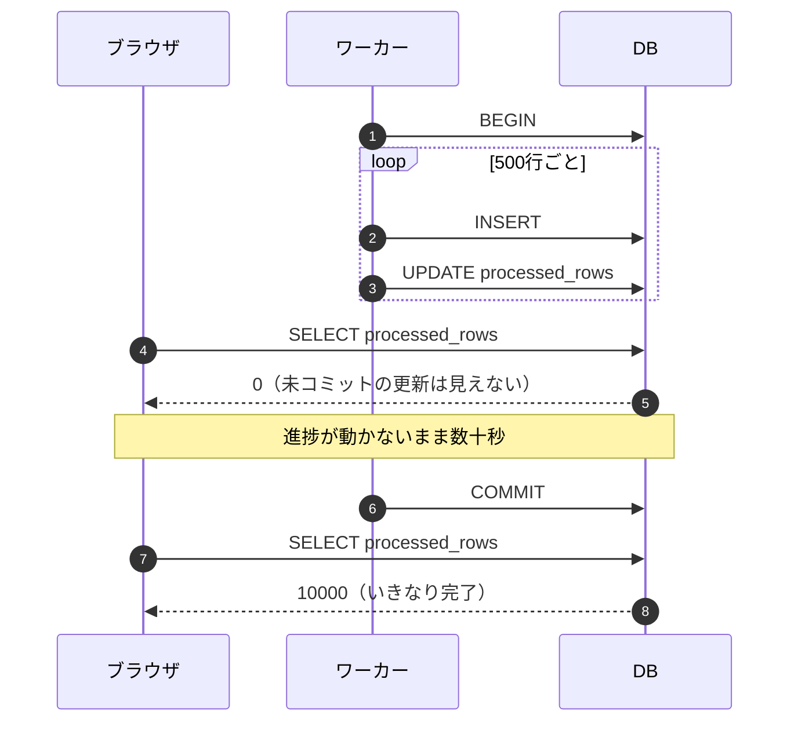
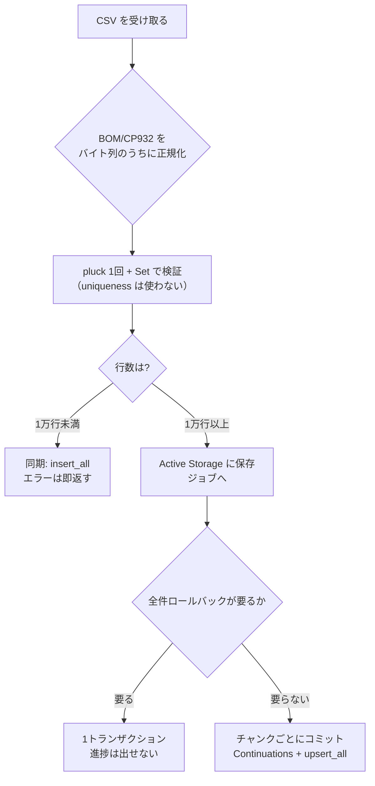

CSV インポートは Rails の仕事のなかでも情報が多い領域です。BOM の剥がし方、`insert_all` の使い方、バッチサイズの決め方。検索すればいくらでも出てきます。

素の `rails new` から始めて、それらを一つずつ手元で測りました。結果として、**流通している話のうち3つが今の Rails では成り立たなくなっていました**。そしてもっと重要なことに、別々に調べていると気づかない**「同時には満たせない要件」が1組**見つかりました。

この記事は、その実測の記録です。

## この記事で書くこと・書かないこと

**書くこと**

| 内容 | どこまで |
| --- | --- |
| 文字コード | BOM と CP932。Active Storage 経由とフォーム送信の両方 |
| 読み取り | ユーザーに返す行番号、Excel の値の型キャスト |
| 検証と書き込み | 1万行の工程別内訳、`insert_all` の挙動、バッチサイズ |
| 進捗とジョブ | 進捗表示とトランザクションの関係、`ActiveJob::Continuable` での再開 |
| コントローラ | 入り口の検証がどこまで届くか、Turbo が要求するステータスコード |
| 設計 | 測った結果として落ち着いたクラス構成と、同期・非同期の振り分け |

**書かないこと**

| 内容 | 理由 |
| --- | --- |
| PostgreSQL / MySQL での挙動 | **試していません。** SQLite でしか測っていないので、後述のとおり比は移せても絶対値は移せません |
| gem（`activerecord-import` など）の比較 | 素の Rails でどこまでできるかが主題です |
| Excel ファイル（`.xlsx`）の取り込み | CSV に絞ります |
| 巨大ファイル（100万行以上）やストリーミングアップロード | **試していません。** 測ったのは最大5万行です |
| 文字コードの自動判別 | 「CP932 か UTF-8 かを推測する」はやっていません。指定する前提です |

**想定読者**は、Rails で CRUD を書いたことがあり、`insert_all` や Active Job の名前は知っているけれど実際の挙動までは追っていない人です。

## 検証環境

| 項目 | 値 |
| --- | --- |
| OS | macOS（Apple M5, arm64） |
| Ruby | 4.0.6 |
| Rails | 8.1.3.1 |
| csv | 3.3.6 |
| solid_queue | 1.7.0 |
| SQLite | 3.53.2（WAL） |
| 検証日 | 2026-08-30 |

この記事に貼っている出力・エラー・数値は、すべてこの環境で実行したものです。コードは [zenn-examples/rails81-csv-import-pitfalls](https://github.com/y-sakamoto-lu-llc/zenn-examples/tree/<commit>/rails81-csv-import-pitfalls) にあります。

DB が SQLite であることは、後半の数値にかなり効きます。特に `insert_all` の SQL 生成と `validates uniqueness` の N+1 は、アダプタが変われば結論が変わりうるところです。この点は後半の「自分では確かめていないこと」に分けて書きました。

## 結論

先に全部書きます。

**1. 一般論として流通している話のうち、3つが実測で覆りました。**

| よく言われていること | 実測 |
| --- | --- |
| BOM は `encoding: "bom\|UTF-8"` を付ければ剥がせる | **読み込んだ String には効きません。** `blob.download` から読むと1列目が例外なしで `nil` になります |
| セル内改行があると行番号がズレるので自前に数えるべき | **ズレません。** `CSV#lineno` は物理行ではなくレコードを数えています |
| `insert_all` のバッチサイズはプレースホルダ上限 ÷ 列数で決める | **Rails 8.1 + SQLite では値がリテラルとして埋め込まれます。** 上限は検出できませんでした |

**2.「全件ロールバック」と「進捗表示」は同時に満たせません。** 1トランザクションで囲めば、外から進捗は見えません。見えるようにするには途中でコミットするしかなく、その時点で全件巻き戻しは諦めることになります。実装の工夫ではなく、要件としてどちらかを選ぶ話です。

**3. 時間の 93.7% はバリデーションでした。** CSV のパースも DB への書き込みも誤差です。そしてその内訳は `validates uniqueness` の N+1 で、**しかもそれは1つの CSV の中の重複を見ていません**。遅いうえに肝心なものを見ていないので、CSV インポートの経路で使う理由がありません。

**4. 一番危険なのは例外を出さずに壊れる経路です。** BOM は1列目を `nil` にし、不正な日付は `nil` になり、`insert_all` は重複を黙って捨てます。どれもログにも例外にも出ません。

## 1. 入り口 — require "csv" と文字コード

### そもそも `require "csv"` が落ちる

Ruby 3.4.0 で `csv` は bundled gem になり、Rails 8.1 の既定 Gemfile には入っていません。何も考えずに `require "csv"` すると、こうなります。

```
LoadError: cannot load such file -- csv
warning: csv used to be loaded from the standard library,
but is not part of the default gems since Ruby 3.4.0.
```

`gem "csv"` を Gemfile に足せば済む話ですが、同じことが `benchmark` にも起きます（こちらは Ruby 4.0.0 から）。計測コードを書こうとして2度踏みました。

### BOM の除去は「ファイルを開く指示」で、読んだ後の String には効かない

Excel が保存した CSV には BOM（`EF BB BF`）が付きます。よく紹介されるのは `encoding: "bom|UTF-8"` を渡す方法ですが、**Active Storage から受け取ると、これがほとんどの経路で効きません**。

失敗する形から見ていきます。`blob.download` が返すのは ASCII-8BIT の String で、ファイルパスに対して効く `bom|UTF-8` が通りません。

| Active Storage からの受け取り方 | 1列目のヘッダ | `row["code"]` |
| --- | --- | --- |
| `blob.download` をそのまま `CSV.parse` | `"\xEF\xBB\xBFcode"` | `nil` |
| `blob.download` + `encoding: "bom\|UTF-8"` | `ArgumentError: unknown encoding name` | — |
| `blob.download.force_encoding("UTF-8")` | `"code"` | `nil` |
| `blob.open { \|f\| CSV.parse(f.read) }` | `"\xEF\xBB\xBFcode"` | `nil` |
| `blob.open` + `f.set_encoding("bom\|utf-8")` | `Encoding::ConverterNotFoundError` | — |
| `blob.open` + `CSV.new(f, encoding: "bom\|UTF-8")` | `"\xEF\xBB\xBFcode"` | `nil` |
| `blob.open` + `CSV.read(f.path, encoding: "bom\|UTF-8")` | `"code"` | `"JP-001"` |
| `blob.download.delete_prefix("\xEF\xBB\xBF".b)` | `"code"` | `"JP-001"` |

上の6つが全滅で、**うち4つは例外を出さずに `nil` を返します**。「1列目だけ全行 `nil`」という壊れ方をするので、`code` が必須でなければ気づかないまま取り込みが終わります。

通る2つと通らない6つを分けているのは、`bom|` が変換器ではなく**「IO を開くときの指示」**だということです。`CSV.read(path, ...)` は CSV 自身がファイルを開くので効きます。一度 `read` して String にしてから渡すと、もう剥がす機会がありません。`blob.open` はパスを持つ `Tempfile` を yield するので、`f.read` ではなく `f.path` を渡せば効きます。

規則は一つです。**BOM を `bom|` に剥がさせたいなら、パスを渡す。読んだ後では遅い。**

### それでもバイト列のうちに落とすほうがいい

パスを渡せば効くと分かっても、CSV インポートでは自分で剥がすほうが得です。`bom|` はパスがある経路でしか使えないので、アップロード直後（`params[:file].tempfile.path`）とジョブ（`blob.open` の `f.path`）で書き方が変わってしまいます。バイト列に対する処理なら、どちらから来ても同じコードが通ります。

読み取りの入り口に置く1行です。

```ruby
body = bytes.delete_prefix("\xEF\xBB\xBF".b).force_encoding("UTF-8")
```

**順序が重要です。** `force_encoding` を先にやってから `sub(/\A\xEF\xBB\xBF/n, "")` と書くと、BINARY の正規表現と UTF-8 の文字列を突き合わせることになり `Encoding::CompatibilityError` になります。剥がしてから、エンコーディングを付ける。

CP932 のほうは素直で、`encoding: "CP932:UTF-8"` は `blob.download` が返す String にもそのまま効きます。特別扱いが要るのは BOM だけです。

### 無言になるかどうかはスキーマが決めている

BOM が壊すのは1列目だけです。そこから先どうなるかは、その列の制約次第でした。

| 1列目の列 | 制約 | `insert_all` で詰めた結果 |
| --- | --- | --- |
| `category` | NOT NULL なし / `presence` なし | 2 件入り、うち 2 件が `nil`（例外なし） |
| `code` | NOT NULL あり / `presence` あり | `ActiveRecord::NotNullViolation` |

`create!` 経由なら `presence` が受け止めますが、`insert_all` はそれを飛ばします。**速度を理由に `insert_all` を選ぶと、BOM に対する安全網が1枚外れます。** 1列目が必須の設計なら必ず落ちて表面化しますが、それはスキーマ次第の偶然でしかありません。入り口で剥がすのが唯一の確実な手です。

### `Shift_JIS` と書くと ① と 髙 が落ちる

日本語 CSV では CP932 で保存されたファイルが来ます。ここで `Shift_JIS` と書くか `Windows-31J` と書くかで、通る文字が変わります。文字を1つずつ変換して確かめました。

| 文字 | コードポイント | `Shift_JIS` へ | `Windows-31J` へ |
| --- | --- | --- | --- |
| ① | U+2460 | 拒否 | 通る |
| ㈱ | U+3231 | 拒否 | 通る |
| 髙 | U+9AD9 | 拒否 | 通る |
| 﨑 | U+FA11 | 拒否 | 通る |
| ㎡ | U+33A1 | 拒否 | 通る |
| 〜 | U+301C | 通る | 拒否 |
| ～ | U+FF5E | 拒否 | 通る |
| 𠮷 | U+20BB7 | 拒否 | 拒否 |

拒否する文字がほぼ逆になっています。そして**日本語 CSV で実際に出る文字（丸数字・㈱・人名の異体字）は全部 `Windows-31J` 側にしかありません**。読むときは `CP932:UTF-8` を指定します。往復は一致したので、`invalid: :replace` で潰す必要もありませんでした。

一方、エラー CSV を CP932 で返す側では逆のことが起きます。波ダッシュ U+301C が `?` に落ちるので、UTF-8 の元データに U+301C が混ざっていると返却時に1文字だけ壊れます。**エラー CSV は BOM 付き UTF-8 で返すほうが安全**で、Excel もそれで開けます。

受ける側は BOM を剥がし、返す側は BOM を付ける。同じ機能の入口と出口で逆のことをすることになります。

## 2. 読み取り — 行番号と型キャスト

### ユーザーに返す行番号は信用してよい（仮説が外れた）

「セル内改行があると `CSV#lineno` が物理行を数えてしまうので、レコード数は自前でカウントすべき」と予想していました。**外れました。**

セル内改行を含む CSV を読んで、4つの数え方を並べたものです。

| レコード | 自前カウンタ | `CSV#lineno` | `$.` | Excel の行番号 |
| --- | --- | --- | --- | --- |
| NL-001 | 1 | 2 | 1 | 2 |
| NL-002（セル内改行あり） | 2 | 3 | 1 | 3 |
| NL-003 | 3 | 4 | 1 | 4 |

`CSV#lineno` は物理行ではなくレコードを数えています。LF / CRLF / CR のどれでも、セル内改行を2箇所含む5レコードのファイルで `lineno` は 6（ヘッダ込み）に収まりました。**そのままユーザーに「N行目」として出せます。**

ただし2つ注意点があります。

- `$.`（`$INPUT_LINE_NUMBER`）は `CSV` が更新しないので `1` のままです
- `CSV::MalformedCSVError` のメッセージが指す行番号は**別系統**です。クォートが閉じていないファイルでは `in line 2` と物理行を指しました

正常系の `lineno` と異常系の例外メッセージで数え方が違います。エラー行番号をユーザーに出すなら、例外メッセージをそのまま貼らずに `lineno` を添えるほうが一貫します。

### Excel の値は型キャストで黙って別の数字になる

Excel で編集された CSV には、桁区切りや全角数字や和暦が混ざります。`Product.new(...)` に渡したときに何が起きるかを見ます。

| 入力値 | キャスト後 | `valid?` で気づけるか |
| --- | --- | --- |
| `price = "1,200"` | `1` | 検出する（is not a number） |
| `price = "１５００"` | `0` | 検出する |
| `price = "12.9"` | `12` | 検出する（must be an integer） |
| `released_on = "2026/2/29"` | `nil` | **素通り** |
| `released_on = "令和8年4月1日"` | `nil` | **素通り** |
| `released_on = "2026-13-01"` | `nil` | **素通り** |

数値は救われます。`numericality` がキャスト後ではなく元の文字列を見ているので、`"1,200"` が `1` になっても弾けます。

**日付は救われません。** 存在しない日付も和暦も `nil` になり、`presence` を付けていなければそのまま通ります。日付列に `validates presence: true` を付けるか、`released_on_before_type_cast` を自分で見るかしないと、**2月29日が全部 NULL で入ります**。

## 3. 検証と書き込み — 時間の 93.7% はバリデーション

### 工程別の内訳

1万行を取り込むときに、どこで時間を使っているかを測りました。

| 工程 | 秒 | 割合 |
| --- | --- | --- |
| `CSV.parse` | 0.017 | 0.6% |
| Hash への詰め替え | 0.009 | 0.3% |
| `Product.new(...).valid?` | 2.66 | **93.7%** |
| `insert_all`（1000行ずつ） | 0.151 | 5.3% |

CSV のパースは誤差です。DB への書き込みも誤差です。**遅いのはバリデーションだけ**で、その中身を掘ると `validates uniqueness` の N+1 でした。

### `uniqueness` を外すと19倍速くなり、しかも検出が増える

同じ1万行を3つの方法で検証しました。

| やり方 | 秒 | SQL 発行回数 | 検出できるもの |
| --- | --- | --- | --- |
| `valid?`（`uniqueness` 込み） | 2.72 | 10000 | 全部 |
| `uniqueness` だけ外す | 0.14 | 0 | presence / numericality |
| `pluck(:code)` 1回 + `Set` | 0.00 | 1 | **DB の重複 + ファイル内の重複** |

19倍の差が付きますが、重要なのは速度より右端の列です。**`validates uniqueness` は未保存の行どうしの重複を見ません。**

| 状況 | 結果 |
| --- | --- |
| 先に `save!` した行との重複 | 見える（弾く） |
| 同一トランザクション内で先に `create!` した行との重複 | 見える（弾く） |
| `save` せず `valid?` を2回呼んだだけ | **両方通る** |

CSV インポートで一番よく起きる事故は「1つのファイルの中に同じ `code` が2行ある」です。全行を `valid?` してから `insert_all` する構造だと、`uniqueness` はまさにそれを見逃します。遅いうえに肝心なものを見ていないので、**CSV インポートの経路で `uniqueness` を通す理由がありません**。

置き換えはこうなります。既存キーを1回の `pluck` で集めて、`Set#add?` でファイル内の重複も同時に見ます。

```ruby
existing = Product.where(code: codes).pluck(:code).to_set
seen = Set.new

rows.each do |row|
  next errors << [row.lineno, "重複しています"] if existing.include?(row["code"])
  next errors << [row.lineno, "ファイル内で重複しています"] unless seen.add?(row["code"])
  # ...
end
```

`add?` は既にある要素なら `nil` を返すので、これ1つで「ファイル内の2回目」を拾えます。SQL は最初の `pluck` の1回だけです。

### `insert_all` は重複を例外なしで捨てる

`insert_all` / `upsert_all` がバリデーションとコールバックを飛ばすことはガイドに書いてあります。書いていない挙動のほうを表にします。

| 項目 | `create!` | `insert_all` | `upsert_all` |
| --- | --- | --- | --- |
| `before_save` で作る列 | 入る | `nil` | `nil` |
| `after_create_commit` | 走る | 走らない | 走らない |
| `created_at` / `updated_at` | 入る | **入る** | **入る** |
| `validates` | 弾く | 素通り | 素通り |
| `price` に `"1,200"` | `RecordInvalid` で弾く | `1` が入る | `1` が入る |
| 同じ `code` を2回 | `RecordInvalid` | **例外なし** | 例外なし |

timestamps は飛びません。飛ぶと思って `Time.current` を自分で詰めると二重になります。逆に `record_timestamps: false` を指定すると、`t.timestamps` が NOT NULL なので `ActiveRecord::NotNullViolation` になります。切れません。

重複が例外にならないのは、Rails が `ON CONFLICT DO NOTHING` を付けるからです。実際に発行された SQL です。

```sql
INSERT INTO "products" (...) VALUES (...) ON CONFLICT  DO NOTHING RETURNING "id"
```

2行渡して1行が既存と衝突したとき、戻り値の行数は 1、増えた行数も 1、既存行は元の値のままでした。例外も警告も出ません。**「1000行のファイルを入れたのに 800行しか増えていない」を検知したいなら、戻り値の行数と入力行数を自分で突き合わせるしかありません。**

```ruby
result = Product.insert_all(chunk)
raise "#{chunk.size - result.length} 行が捨てられました" if result.length != chunk.size
```

例外にしたいだけなら `insert_all!`（bang 付き）で `ActiveRecord::RecordNotUnique` が飛びます。

なお `upsert_all` の更新セマンティクスは素直でした。渡さなかった列は元の値が残り、`created_at` は保たれ、`updated_at` だけ更新されます。部分更新としてそのまま使えます。

### バッチサイズをプレースホルダ上限から決める必要はない

「`insert_all` のバッチサイズは `SQLITE_MAX_VARIABLE_NUMBER`（32766）÷ 列数で決めろ」という話が流通しています。**Rails 8.1 + SQLite では当てはまりませんでした。** 値はプレースホルダではなく、リテラルとして SQL に埋め込まれます。

生成された SQL の冒頭です。

```sql
INSERT INTO "products" ("code","name","price","created_at","updated_at")
VALUES ('SQ-1', 'n1', 1, STRFTIME(...), STRFTIME(...)), ('SQ-2', ...
```

`?` が1つもありません。行数と列数を振って上限を探しました。

| 列数 | 行数 | 生成された SQL の長さ | 結果 |
| --- | --- | --- | --- |
| 5 | 100,000 | 9.3 MB | 入る |
| 5 | 200,000 | 18.9 MB | 入る |
| 9 | 100,000 | 13.3 MB | 入る |
| 9 | 200,000 | 27.3 MB | 入る |

**上限を検出できませんでした。** 制約はプレースホルダ数ではなく、SQL 文字列をメモリに持てるかどうかに変わっています。

1000行ずつに切るのは正しいのですが、その理由は「上限に当たるから」ではなく「27MB の文字列を作らないため」です。ちなみに速度は、1万行を1回で入れても1000行ずつでも変わりませんでした（0.16 秒 / 0.15 秒）。切る目的はメモリだけです。

## 4. 進捗とジョブ — 両立しない要件

### 全件ロールバックと進捗表示は同時に満たせない

ここが今回いちばん効いた発見です。そして**論点を別々に調べていると出てきません**。「トランザクションで囲む」も「進捗を DB に書く」も、単体では何の問題もないからです。

1万行を1トランザクションで囲み、500行ごとに `import_batches.processed_rows` を更新しながら、**別プロセスから**その値を読みました。

| 方式 | 1秒後に外から見えた進捗 | 失敗時に全件巻き戻せるか |
| --- | --- | --- |
| 1トランザクション・中で進捗更新 | **0** | 巻き戻せる |
| 1トランザクション・別コネクションで進捗を書く | **0** | 巻き戻せる |
| 500行ごとにコミット | 1500 | **巻き戻せない** |

未コミットの `UPDATE` は外から見えません。当たり前のことですが、進捗バーの実装としては致命的です。



`ActiveRecord::Base.connection_pool.with_connection` で別コネクションを取って進捗だけ書く、という回避も試しましたが**見えませんでした**。同じプールの同じ接続が返ってくるので、結局トランザクションの中に入ってしまいます。本当に分けるなら別のコネクションプール（別 DB 接続）が要ります。

**「全件ロールバックする」と「進捗を出す」は、同時に満たせない要件として扱うのが正しい**と思います。どちらを取るかを先に決めないと、進捗バーが 0% のまま固まるか、失敗したのに半分入っている状態になります。

### 進捗の更新頻度そのものは、粗ければタダに近い

どちらを取るか決めたうえで、進捗を出す側の話です。更新頻度を振りました。

| 更新頻度 | 秒 | UPDATE 回数 | 上乗せ |
| --- | --- | --- | --- |
| 更新しない | 0.171 | 0 | — |
| 100 行ごと | 0.167 | 100 | 誤差 |
| 10 行ごと | 0.313 | 1000 | +83% |
| 1 行ごと | 1.936 | 10000 | **+1031%** |

100行ごとなら計測誤差の範囲です。1行ごとにすると11倍になります。粗く更新する分には気にしなくてよい、という結論でよさそうです。

### development ではジョブからの進捗がブラウザに届かない

進捗を Turbo Streams で流そうとすると、手元と本番で挙動が変わります。

| 項目 | 値 |
| --- | --- |
| development の cable アダプタ | `async`（プロセス内） |
| production の cable アダプタ | `solid_cable` |
| development の `cable` DB 定義 | 無い |
| 同一プロセス内の broadcast | 届く |
| 別プロセスからの broadcast | **届かない** |

`config/cable.yml` 自身がコメントで「Async adapter only works within the same process」と書いています。**Solid Queue を development で動かした瞬間に、進捗表示だけが本番と違う挙動になります。** 同期処理では動くのに `bin/jobs` 経由だと動かない、という形で出るので、原因を CSV 側に探しに行くと時間を溶かします。

手元で進捗を確認したいなら、development の cable も `solid_cable` にする（`cable` DB を足す）必要があります。

### 中断したジョブは cursor から正確に再開する

Rails 8.1 の `ActiveJob::Continuable` に行オフセットを載せ、`bin/jobs` に `SIGTERM` を送りました（Kamal のデプロイ相当です）。

| 測ったこと | 1万行 | 5万行 |
| --- | --- | --- |
| 中断した位置 | 8,000 | 36,000 |
| 保存された continuation | `{"current" => ["import_rows", 8000]}` | `{"current" => ["import_rows", 36000]}` |
| 再開後のログ | `cursor=8000 resumed=true resumptions=1` | `cursor=36000 resumed=true resumptions=1` |
| 最終行数 | 10,000 | 50,000 |
| 重複した行 | **0** | **0** |

1バッチ分すら再処理されませんでした。ただしこれは `step.set!(offset)` を**書き込みの後に**呼んでいるから成り立ちます。

```ruby
step :import_rows do |step|
  rows.drop(step.cursor).each_slice(1000) do |chunk|
    Product.insert_all(chunk)          # 先に書く
    step.set!(step.cursor + chunk.size) # あとで進める
  end
end
```

順序を逆にすれば、中断したチャンクは丸ごと失われます。**cursor の正しさは Continuations が保証するのではなく、`set!` をどこで呼ぶかが決めています。**

再開のたびに CSV は先頭から読み直されます。CSV は行シークできないので避けられません。5万行で 0.22 秒（1万行で 0.073 秒）なので実用上は問題になりませんが、再開回数に比例して効きます。中断が頻繁に起きる環境なら、パース済みの行を一度 DB に落としてから処理するほうが筋がよさそうです。

細かいところでは、再開されたジョブは `ScheduledExecution` に入ります（既定で 5 秒後）。`ready?` が false なので、**中断直後にキューを見ると「実行待ちが無い」ように見えます**。消えたと勘違いしないように。

### 例外で落ちた場合、cursor が残るのが裏目に出る

中断だけでなく、例外で落ちた場合も cursor は残ります。これが厄介です。データに起因する例外を仕込んで `retry_on` を付けたときのログです。

```
[crash] step 開始 cursor=0    resumed=false resumptions=0 executions=1
[crash] cursor=3000 で例外を投げる
[crash] step 開始 cursor=3000 resumed=true  resumptions=1 executions=2
[crash] cursor=3000 で例外を投げる
[crash] step 開始 cursor=3000 resumed=true  resumptions=2 executions=3
[crash] cursor=3000 で例外を投げる
[crash] step 開始 cursor=3000 resumed=true  resumptions=3 executions=4
```

cursor が保たれる分、**毎回きっちり同じ場所で落ちます**。リトライは時間を捨てるだけです。`retry_on` はネットワークや一時的なロックには効きますが、CSV の中身が原因のエラーには効きません。データ起因のエラーに `retry_on` を付けない、というのがここでの結論です。

もう1つ。`retry_on RuntimeError, attempts: 3` を指定したのに**4回実行されました**。Continuations を外した対照ジョブでは 3 回で止まります。`attempts` の数え方が Continuations と併用すると変わるようです（そういう仕様なのか不具合なのかまでは追っていません）。

## 5. コントローラ — 入り口の検証はどこまで届くか

### 先頭 N 行までしか届かない

コントローラで「アップロードされた CSV が妥当か」を確かめようとすると、すぐに壁に当たります。**CSV が読めるかどうかは、最後まで読まないと確定しません。** だが全部読むなら、大きいファイルをジョブに回す意味が薄れます。

折衷として先頭100行だけ読んで構造を見る形にし、どこまで捕まえられるかを測りました。

| 入力 | HTTP ステータス | どこで捕まったか |
| --- | --- | --- |
| ファイル未選択 | 422 | フォームの検証 |
| ヘッダが想定と違う（列名が日本語） | 422 | フォームの検証 |
| 2行目でクォートが閉じない | 422 | フォームの検証（先頭100行に入っている） |
| 5000行目でクォートが閉じない | **303** | すり抜けて、取り込み中に `failed` として記録 |

同じ「壊れた CSV」でも、壊れている位置で応答が変わります。これは実装の穴ではなく、入り口で全部読まない限り避けられません。

したがって **`create` は「検証を通ったものは必ず成功する」前提では書けません。** 失敗も記録できる形にしておき、`CSV::MalformedCSVError` を例外ではなく**取り込み結果として**扱う必要があります。

### 素朴に書くとここが 500 になる

先に失敗版を見ます。`CSV.parse(params[:file].read)` して `create!` をループで回す、一番素直な実装です。

| 入力 | 推奨形 | 素朴な実装 |
| --- | --- | --- |
| CP932 | 303 / `completed` / 5 件 | **500** / 0 件 |
| BOM 付き UTF-8 | 303 / `completed` / 5 件 | **500** / 0 件 |
| 500行目が不正 | 303 / `failed` / 0 件 | **500** / 0 件 |

日本語 CSV の3大パターンが全部 500 です。CP932 と BOM は1章の正規化で消えますが、3行目は消えません。`CSV::MalformedCSVError` を `rescue` して `ImportBatch` に `failed` を書く、という経路を最初から作っておくことになります。

### Turbo は 303 と 422 を要求する

素の `rails new`（Turbo 同梱）でフォームを作ると、普通のステータスコードでは動きません。

| 状況 | 返すべき | 200 や 302 だと |
| --- | --- | --- |
| 成功してリダイレクト | 303 See Other | Turbo がリダイレクト先へ POST を繰り返す |
| バリデーションエラーで再描画 | 422 Unprocessable Content | 画面が差し替わらず、エラーが見えない |

```ruby
redirect_to import_batch_path(batch), status: :see_other
render :new, status: :unprocessable_entity
```

CSV インポート固有の話ではありませんが、**エラーを画面に出すことがこの機能の主目的**なので、ここを外すと機能自体が成立しません。省略できない2行です。

### エラー CSV の返し方

エラー行をダウンロードさせるレスポンスはこうなりました。

| 項目 | 値 |
| --- | --- |
| `Content-Type` | `text/csv; charset=utf-8` |
| `Content-Disposition` | `attachment; filename="errors_43.csv"; filename*=UTF-8''errors_43.csv` |
| 先頭バイト | `EF BB BF`（BOM を付けて Excel で開けるようにする） |
| 日本語ファイル名を渡すと | ASCII 側が `filename="%3F%3F%3F%3F%3F.csv"` に落ちるが、`filename*=UTF-8''...` が併記されるので実用上は通る |

1章で書いたとおり、返す側は BOM を付けます。CP932 で返すと波ダッシュが壊れるので、UTF-8 + BOM が安全です。

### アップロードと Active Storage の違いは「パスがあるか」だけ

同期経路（`params[:file]`）と非同期経路（Active Storage の `blob`）で、読み取りコードを分けるべきかどうかを確かめました。

| 項目 | `params[:file]`（フォーム送信） | Active Storage の `blob` |
| --- | --- | --- |
| クラス | `ActionDispatch::Http::UploadedFile` | `ActiveStorage::Attached::One` |
| `read` が返す encoding | ASCII-8BIT | ASCII-8BIT |
| 実体 | `Tempfile`（パスあり） | サービス上の blob（`blob.open` で Tempfile になる） |
| `bom\|UTF-8` を使えるか | `tempfile.path` を渡せば効く | `blob.open` の `f.path` を渡せば効く |

**`read` の結果は同じ**なので、バイト列に対して正規化する限り、どちらから来ても同じコードが通ります。逆に `bom|` に頼ると経路ごとに書き分けることになります。1章で「バイト列のうちに落とすほうがいい」と書いた理由がここです。

なお Rack はサイズによらず常に `Tempfile` を作ります（265 バイトのファイルでも作られました）。メモリに載る小ファイルの特例は無いので、`tempfile.path` はいつでも使えます。

### コントローラに何を残すか

測った結果、コントローラの仕事は3つに絞れました。**受け取る・振り分ける・返す。** 読み取りと検証と書き込みは全部外に出ます。

```
app/
  models/
    csv_source.rb     バイト列 → 行。BOM/CP932 の正規化と digest はここだけ
                      params[:file] からも blob からも同じ入り口で作れる
    import_form.rb    ActiveModel。ファイルが CSV として読めるかを先頭100行で判定
                      同期か非同期かの分岐（SYNC_MAX_BYTES）もここ
    import_runner.rb  検証と書き込み。同期経路とジョブが同じコードを通る
  jobs/
    csv_import_job.rb Continuable。ImportRunner を呼ぶだけ
  controllers/
    import_batches_controller.rb   new / create / show / errors
```

`ImportForm` を `ImportBatch`（永続化する記録）と分けているのは、**「CSV として読めるか」が保存する前に決まる話**だからです。読めないファイルの `ImportBatch` を作っても、記録として意味がありません。

`ImportRunner` を切り出す理由は、同期経路とジョブで同じ検証を通すためです。ここが2箇所に分かれると「小さいファイルだけ通るが、大きいファイルは弾かれる」という差が出ます。

### 同期・非同期はバイト数で振り分ける

行数で振り分けたくなりますが、行数を数えるにはパースが要ります。パースするなら非同期にする意味が薄れるので、バイト数から見積もりました。実測で 43 バイト/行（5列・日本語混じり）でした。

| ファイル | 実サイズ | 見積り行数 | 実行数 | 振り分け |
| --- | --- | --- | --- | --- |
| 1,000行 | 40.9 KB | 973 | 1,000 | 同期 |
| 10,000行 | 418.0 KB | 9,954 | 10,000 | 同期 |
| 50,000行 | 2,133.1 KB | 50,798 | 50,000 | 非同期 |

1万行で誤差 0.5%。閾値の判定には十分でした。Active Storage に保存するのは非同期に回すときだけで、同期処理では `tempfile` を読んで捨てます。

### 二重アップロードは「成功した取り込み」だけで拒否する

同じファイルを2回投げたときの扱いです。チェックサムを見る対象を `completed` に限ることで両立しました。

| 状況 | 2回目 |
| --- | --- |
| 1回目が成功していた | 422 で拒否（取り込み済み） |
| 1回目が失敗していた | 303 で受け付ける（投げ直せる） |

チェックサムだけで拒否すると、部分失敗からの復旧を塞ぎます。`status: "completed"` を条件に入れるかどうかだけの違いですが、これが無いと**「失敗したので直して再アップロード」ができなくなります**。

## 6. 何行から非同期にするか

工程の内訳から分かるのは、**閾値を決めているのは行数ではなく「どう検証するか」**だということです。同じ1万行でも実装で3桁変わります。

| 実装 | 1万行 | 1行あたり |
| --- | --- | --- |
| `create!` を1行ずつ（トランザクション外） | 12.11 秒 | 1.21 ms |
| `create!` を1トランザクションで | 8.07 秒 | 0.83 ms |
| `valid?` + `insert_all` | 2.91 秒 | 0.30 ms |
| 素の Ruby で検証 + `insert_all` | 0.01〜0.02 秒 | 0.002 ms |

許容応答時間から逆算した上限です（DB 処理だけ。アップロードとレンダリングは別に要ります）。

| 許容応答時間 | `create!` なら | `valid?` + `insert_all` なら |
| --- | --- | --- |
| 1 秒 | 約 1,200 行 | 約 3,300 行 |
| 3 秒 | 約 3,600 行 | 約 10,000 行 |
| 10 秒 | 約 12,000 行 | 約 33,500 行 |
| 30 秒 | 約 36,000 行 | 約 100,000 行 |

入力制限を MB でかけるときは、1行 = 約 43 バイト（5列・日本語混じり）、1MB ≒ 24,000 行が目安です。

メモリのほうは、読み方を変えればほぼ増えません。

| 読み方 | 5万行での RSS 増分 |
| --- | --- |
| `CSV.read`（全件を配列に） | 約 20 MB |
| `CSV.foreach`（1行ずつ） | ほぼ 0 MB |

ただし**エラーを全件集めると `foreach` の効果は消えます**。5万行すべてが不正なとき、`Product` オブジェクトごと持つと 369 MB、行番号とメッセージだけなら 58 MB、先頭100件で打ち切れば 27 MB でした。読み方より**エラーの持ち方**のほうが支配的です。エラーは先頭 N 件で打ち切るか、行番号と文字列だけにします。

ここまでを1枚にするとこうなります。



## 自分では確かめていないこと

**PostgreSQL / MySQL では測っていません。** 数値はすべて Apple M5 / SQLite / WAL でのものです。特に次の2つはアダプタで結論が変わりうるところです。

- `validates uniqueness` の N+1 — 19倍という比はどの DB でも出ると思いますが、絶対値は移せません
- `insert_all` のリテラル埋め込み — PostgreSQL アダプタが同じ SQL を生成するかは確かめていません。プレースホルダを使う実装なら、バッチサイズの結論（上限を気にしなくてよい）は**逆になります**

**100万行以上、ストリーミングアップロード、複数ファイルの同時取り込みは試していません。** 測ったのは最大5万行です。

**`retry_on` の `attempts` が Continuations と併用すると1回多く実行される件**は、事実として観測しただけで、仕様なのか不具合なのかは追っていません。Rails 側の issue も確認していません。

**エラー CSV の Excel での実際の開き心地**は、`Content-Disposition` とバイト列までしか確認していません。各バージョンの Excel でどう見えるかは試していません。

そして、**この結論が古くなる条件**を書いておきます。以下のどれかが起きたら、この記事の該当箇所は読まないでください。

- `blob.download` が `Encoding` を持った String を返すようになったとき（BOM の話が丸ごと不要になります）
- `CSV` が String に対しても `bom|` を受け付けるようになったとき
- `insert_all` がプレースホルダを使う実装に変わったとき（バッチサイズの結論が逆になります）
- `validates uniqueness` が未保存の行を見るようになったとき（8.1.3.1 では見ません）
- Rails が development の cable を `solid_cable` に切り替えたとき
- `ActiveJob::Continuable` の `attempts` の数え方が `retry_on` と揃ったとき
- Turbo がフォーム送信で 200 を扱えるようになったとき

## まとめ

採用するときのチェックリストとして並べます。

**入り口**

- `gem "csv"` を Gemfile に書く。Ruby 3.4 以降は入っていない（`benchmark` は Ruby 4.0 から）
- BOM はバイト列のうちに落とす。`bytes.delete_prefix("\xEF\xBB\xBF".b).force_encoding("UTF-8")`。順序を逆にすると `Encoding::CompatibilityError` になる
- 文字コードは `CP932`（= `Windows-31J`）と書く。`Shift_JIS` は丸数字も異体字も拒否する
- エラー CSV は BOM 付き UTF-8 で返す。CP932 で返すと波ダッシュが壊れる

**読み取りと検証**

- `CSV#lineno` はそのままユーザーに出せる。セル内改行でズレない
- 日付列には `presence` を付ける。不正な日付は例外にならず `nil` になる
- `validates uniqueness` を CSV インポートの経路で使わない。19倍遅いうえに、ファイル内の重複を見ない
- 検証は同期経路とジョブで同じコードを通す。分かれると「小さいファイルだけ通る」差が出る

**書き込み**

- `insert_all` の戻り値の行数を入力行数と突き合わせる。重複は例外なしで捨てられる
- バッチサイズは 1000 行程度でよい。プレースホルダ上限から計算する必要はない（理由はメモリ）
- `insert_all` を選ぶと `presence` の安全網が外れることを意識する

**ジョブと進捗**

- **「全件ロールバック」と「進捗表示」のどちらを取るか先に決める。両立しない**
- 進捗の更新は 100 行ごと。1行ごとにすると処理時間が 11 倍になる
- `ActiveJob::Continuable` を使うなら `step.set!` は書き込みの後に呼ぶ
- データ起因のエラーに `retry_on` を付けない。cursor が保たれる分、毎回同じ場所で落ちる
- development の cable は `async` なので、ジョブからの進捗は届かない

**コントローラ**

- `redirect_to ..., status: :see_other` と `render :new, status: :unprocessable_entity`
- 入り口の検証は先頭 N 行に限り、`CSV::MalformedCSVError` は取り込み結果として扱う
- 同期・非同期はバイト数で振り分ける。行数を数えるにはパースが要る
- Active Storage に保存するのは非同期に回すときだけ
- 二重アップロードは「成功した取り込み」のチェックサムだけで拒否する

CSV インポートで一番怖いのは遅いことではなく、**例外を出さずに壊れること**でした。BOM で1列目が `nil` になり、不正な日付が `nil` になり、`insert_all` が重複を黙って捨てる。どれもログに出ません。速い実装を選ぶほど安全網が薄くなるので、外した分は自分で確かめる、という形になります。

## 参考

- [Active Record Query Interface — insert_all / upsert_all](https://guides.rubyonrails.org/active_record_querying.html)（2026-08-30 取得）
- [Ruby on Rails 8.1 Release Notes — Active Job Continuations](https://guides.rubyonrails.org/8_1_release_notes.html)（2026-08-30 取得）
