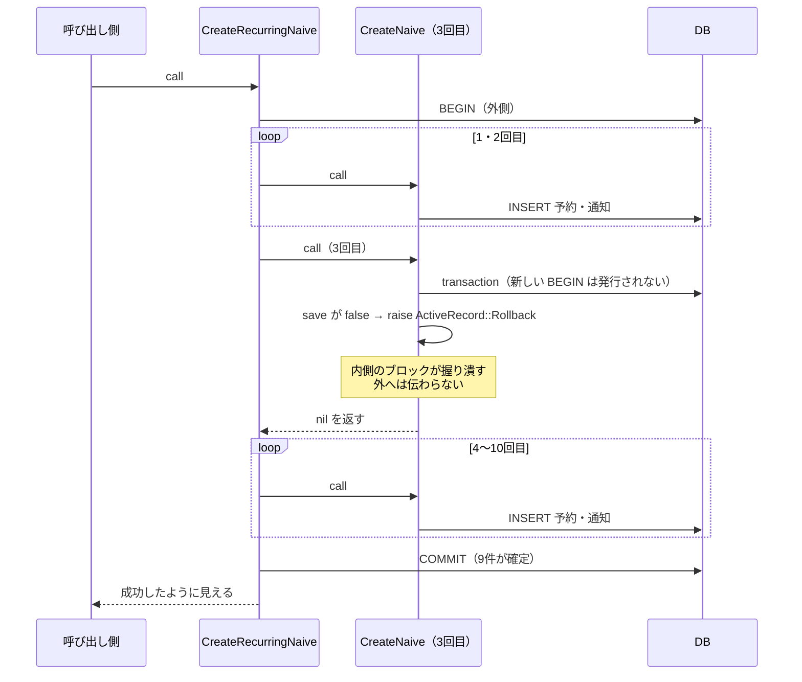

「Fat Model / Fat Controller をどう分離するか」の話は、たいてい**パターンの名前から始まります**。Service Object を置け、Form Object を使え、Query Object に切り出せ。名前が5つ並ぶと、5つとも入れないといけない気がしてきます。

会議室予約という具体的なお題を1本書いて、5つを全部当てて、手元で測りました。結果として**アプリの正しさに効いたのは1つだけ**でした。残りの4つは「入れないと壊れる」ものではありません。それどころか、1つは**入れ方を間違えると正しさが下がりました**。

この記事は、どれが何に効いて、どれが効かなかったかの記録です。

## 前提 — 剥がす対象は5つしかない

先に地図を出します。パターン名がいくつあっても、**Model / Controller から剥がす対象**は5種類しかありません。

| 剥がす対象 | 呼ばれ方 | 素の Rails が持っている受け皿 |
| --- | --- | --- |
| 共有コード | Concern | `ActiveSupport::Concern` |
| 入力（永続化前の検証） | Form Object | `ActiveModel::Model` + `ActiveModel::Attributes` |
| 読み出し（条件の組み立て） | Query Object | `scope` / `ActiveRecord::Relation` |
| 表示（ビュー向けの整形） | Decorator / Presenter | `helper` |
| 手続き（複数モデルにまたがる1操作） | Service Object | **無い** |

右端の列が効いてきます。**素の Rails に受け皿が無いのは「手続き」だけ**です。ほかの4つには最初から置き場所があるので、「新しいクラスを作る」という判断そのものが要りません。

## この記事で書くこと・書かないこと

**書くこと**

| 内容 | どこまで |
| --- | --- |
| 素の CRUD がどこまで足りるか | 予約の重なり判定を validation だけで書いて、境界パターンを確認 |
| 手続きの分離 | トランザクション境界の置き方2種類を比較。片方は静かに壊れる |
| 入力の分離 | 検証を「移す」場合と「足す」場合で、実際に入るレコード数を比較 |
| 読み出しの分離 | Query Object と `scope` の結果比較、`or` / `merge` の挙動 |
| 共有コードの分離 | `Reservable` を2モデルに include。同名メソッドの衝突 |
| 表示の分離 | どこまでモデルで足りるか |

**書かないこと**

| 内容 | 理由 |
| --- | --- |
| gem の比較（dry-rb / Trailblazer / Interactor など） | **使っていません。** 素の Rails でどこまでできるかが主題です |
| PostgreSQL の `EXCLUDE` 制約 | **試していません。** SQLite で使えないことは確認しましたが、その先は手を動かしていません |
| DDD / Clean Architecture の用語との対応 | パターン名の整理は目的ではありません |
| テストの書き方、パフォーマンス | 測ったのは挙動だけです |
| 大規模なアプリでの運用 | 予約対象が2つしかない規模での話です |

**想定読者**は、Rails で CRUD を書いたことがあり、「そろそろモデルが太ってきたので分離したい」と考えている人です。パターン名を知っている必要はありません。

## 検証環境

| 項目 | 値 |
| --- | --- |
| OS | macOS（Darwin 25.3.0） |
| Ruby | 4.0.6 |
| Rails | 8.1.3.1 |
| SQLite | 3.53.2 |
| 検証日 | 2026-08-30 |

この記事に貼っている出力・エラー・件数は、すべてこの環境で実行したものです。コードは記事内に全部載せています（別リポジトリは用意していません）。

## お題を会議室予約にした理由

TODO アプリで試すと、5つの発動条件に**ひとつも当たりません**。作って・一覧して・完了にするだけなので、複数モデルにまたがる手続きも、保存前に決まる検証も出てきません。

社内の会議室予約は、ドメインの都合から5つ全部が自然に出てきます。

| 剥がす対象 | 予約アプリでの実物 |
| --- | --- |
| 共有コード → Concern | `Reservable`（会議室・社用車） |
| 入力 → Form Object | 「毎週火曜 10:00–11:00 を10回」の繰り返し予約 |
| 読み出し → Query Object | 空き会議室検索（日時・フロア・人数・設備） |
| 表示 → Decorator / helper | 「09/01 10:00–11:00」の時間帯表示 |
| 手続き → Service Object | 予約確定（予約＋通知）と、その繰り返し |

## 結論

5つを当てた結果です。

| 分離 | 入れないとアプリが壊れるか | 入れると実際に変わるもの |
| --- | --- | --- |
| **手続き** | **壊れる。** 10回申し込んで9回しか入らない状態が作れてしまう | **正しさ** |
| 入力 | 壊れない。むしろ**やり方によっては悪化する** | UX（何回目が重なったか言える） |
| 読み出し | 壊れない。**結果は `scope` と同じ** | 事故を閉じ込める場所 |
| 共有コード | 壊れない | 2つ目の予約対象が来たときの重複 |
| 表示 | 壊れない | — |

正しさに効くのは「手続き」だけでした。ただし正確に言うと、**効くのは Service Object というクラスではなく「トランザクション境界を1箇所に決めること」**です。サービスへの切り出しは、その境界を目に見える場所に置くための手段でしかありません。

そして「入力」は、**基準に当てはまるからといってそのまま移すと壊れます**。この2つを以下で見ていきます。

## 1. 素の CRUD はどこまで足りるか

分離を考える前に、何もしないと何が足りないのかを確かめます。

### 重なり判定は1行で足りる

予約の「時間が重なっている」判定は、4パターン（後ろに重なる・前に重なる・内側に入る・外側から包む）を列挙したくなります。**列挙は要りません。** 半開区間 `[starts_at, ends_at)` で見れば1行です。

まず予約可能なモデル側の concern です（`Reservable` の妥当性は5章で改めて検討します。ここでは置き場所として使います）。

```ruby
# app/models/concerns/reservable.rb
module Reservable
  extend ActiveSupport::Concern

  included do
    has_many :reservations, as: :reservable, dependent: :destroy
  end

  # 半開区間 [starts_at, ends_at) で重なりを見る。
  # 10:00-11:00 と 11:00-12:00 は「重ならない」。
  def overlapping(starts_at, ends_at, except: nil)
    scope = reservations.where("starts_at < ? AND ends_at > ?", ends_at, starts_at)
    except ? scope.where.not(id: except) : scope
  end
end
```

見るのは `where` の1行です。「既存の開始が申込の終了より前」かつ「既存の終了が申込の開始より後」。この2条件だけで4パターンすべてを拾います。

予約モデル側は、それを validation から呼ぶだけです。

```ruby
# app/models/reservation.rb
class Reservation < ApplicationRecord
  belongs_to :reservable, polymorphic: true
  belongs_to :user
  has_many :notifications, dependent: :destroy

  validates :starts_at, :ends_at, presence: true
  validate  :ends_after_starts
  validate  :no_overlap

  private

  def ends_after_starts
    return if starts_at.blank? || ends_at.blank?
    errors.add(:ends_at, "は開始時刻より後にしてください") if ends_at <= starts_at
  end

  def no_overlap
    return if starts_at.blank? || ends_at.blank? || reservable.blank?
    errors.add(:base, "既存の予約と重なっています") if reservable.overlapping(starts_at, ends_at, except: id).exists?
  end
end
```

`except: id` を渡しているのは、**自分自身を除外しないと既存予約の時刻を更新できなくなる**からです（更新時に自分と重なっていると判定される）。新規作成時は `id` が `nil` なので、実質何も除外しません。

既存の予約 10:00–11:00 がある状態で、5パターンの `valid?` を取りました。

| 申し込み | `valid?` |
| --- | --- |
| 11:00–12:00（隣接） | `true`（半開区間なので重ならない） |
| 10:30–11:30（後ろに重なる） | `false` |
| 09:30–10:30（前に重なる） | `false` |
| 10:15–10:45（内側に入る） | `false` |
| 09:00–12:00（外側から包む） | `false` |

**「難しそうな検証」ほど、まず素で書いてみる価値があります。** ここを分離の入り口にすると、要らない層を1枚増やすことになります。

### 足りないのは2つ

素の CRUD で足りなかったのは次の2点でした。

**1つ目。DB では守れません。** PostgreSQL の `EXCLUDE` 制約に相当するものが SQLite にありません。UNIQUE インデックスは「等しい」しか表せないので、「区間が重なる」を表現できません。実際に投げるとこうなります。

```
ALTER TABLE reservations ADD CONSTRAINT no_overlap
  EXCLUDE USING gist (reservable_id WITH =, tsrange(starts_at, ends_at) WITH &&)
→ ActiveRecord::StatementInvalid: SQLite3::SQLException: near "EXCLUDE"
```

つまり**最後の砦がアプリケーション側にしかありません**。この前提が次章に効いてきます。

**2つ目。`valid?` と `save` が離れると窓が開きます。** これが「入力を剥がす」話に直結します。

## 2. 入力を剥がすと、やり方によっては正しさが下がる

Form Object の一般的な基準は「保存する前に決まる検証があるなら置く」です。会議室予約はこれにぴったり当たります。時間の重なりは保存前に決まるからです。

**当ててみたら、条件は満たすのに、そのまま移すと壊れました。**

### 検証を「移す」と二重予約が入る

Form Object の素朴な形は「フォーム側で検証して、通ったらモデルは検証せずに保存する」です。モデルの validation と二重に走らせたくない、という動機で自然にこうなります。その形が安全かどうかを測りました。

接続を2本使い、**両方に `valid?` を通してから**保存させます。

```ruby
# T["13:00"] は「基準日の 13:00」を返すだけのテスト用ヘルパー
def race(validate:)
  [Notification, Reservation, Room, User].each(&:delete_all)
  user = User.create!(name: "s"); room = Room.create!(name: "A")
  ready, gate = Queue.new, Queue.new

  ths = 2.times.map do
    Thread.new do
      ActiveRecord::Base.connection_pool.with_connection do
        r = Reservation.new(reservable_type: "Room", reservable_id: room.id, user_id: user.id,
                            starts_at: T["13:00"], ends_at: T["14:00"])
        r.valid?                    # 両方ここを通す
        ready << 1; gate.pop        # 片方が保存するまで待たせる
        begin; r.save(validate:); rescue => e; e.class.to_s; end
      end
    end
  end

  2.times { ready.pop }; 2.times { gate << :go }
  ths.each(&:join)
  Reservation.count
end
```

`gate` で待たせているのがポイントです。**2本とも `valid?` を通過した状態を作ってから**、同時に保存させています。

`validate:` を切り替えて5回ずつ実行した結果です。

| やり方 | 5回試した結果 |
| --- | --- |
| 検証してから保存（`save(validate: false)` ＝ **検証を移した Form Object と同じ形**） | `[2, 2, 2, 2, 2]` 件 — **毎回二重予約が入った** |
| `save` のたびに再検証（モデルの validation を残す） | `[1, 1, 1, 1, 1]` 件 |

:::message
後者が1件で収まったのは **SQLite が書き込みを直列化するから**であって、分離レベルによる保証ではありません。他の DB で同じ結果になるかは測っていません。ただし、前者と後者で**窓の広さが桁違い**であることは、DB によらず変わりません。
:::

前者の窓は「フォームを検証してから保存するまで」ですが、フォームの検証は**画面を表示した時点**の話で、保存はその後に来ます。数百ミリ秒ではなく、ユーザーが入力している数十秒がまるごと窓になります。

### 保存前の検証は、まだ保存されていない兄弟を見られない

同じ方向の穴がもう1つあります。繰り返し予約の1回目と2回目を**同じ日時**にして、フォームの検証を通しました。

```
conflicts（DB と突き合わせた結果）→ []
valid?                            → true
save                              → false
errors                            → ["Validation failed: 既存の予約と重なっています"]
実際に入った件数                    → 0
```

`conflicts` が空なのは当然で、**DB にはまだ何も入っていない**からです。フォーム側の検証は「既存の予約」としか突き合わせられません。1回目を保存した直後に2回目が重なることは、保存してみるまで分かりません。

ここで0件で済んでいるのは、モデルの validation を残してあるからです。消していたら2件入っていました。

### 結論は「移す」ではなく「足す」

したがって Form Object の使い方はこうなります。**モデルの validation は消さずに残し、フォーム側は UX のためだけに持つ。**

では UX のために何が言えるのか。フォーム側にしか出せない情報が実際にあります。

```
3 回目（09/15 10:00）が既存の予約と重なっています
```

**「何回目か」を言えるのは、10件をまとめて持っているオブジェクトがあるからです。** `Reservation` 1件ずつの validation では「重なっています」としか言えません。これが Form Object を置く理由の全部でした。

実物です。gem は使っていません（`ActiveModel::Model` + `ActiveModel::Attributes` のみ）。

```ruby
# app/forms/recurring_reservation_form.rb
class RecurringReservationForm
  include ActiveModel::Model
  include ActiveModel::Attributes

  attribute :room_id,    :integer
  attribute :user_id,    :integer
  attribute :first_date, :date
  attribute :start_time, :string
  attribute :end_time,   :string
  attribute :count,      :integer, default: 1
  attribute :purpose,    :string

  validates :room_id, :user_id, :first_date, :start_time, :end_time, presence: true
  validates :count, numericality: { greater_than: 0, less_than_or_equal_to: 52 }
  validate  :no_conflict_with_existing

  def occurrences
    return [] if first_date.blank? || start_time.blank? || end_time.blank?

    Array.new(count.to_i) do |i|
      d = first_date + (i * 7)
      [Time.zone.parse("#{d} #{start_time}"), Time.zone.parse("#{d} #{end_time}")]
    end
  end

  def room = @room ||= Room.find_by(id: room_id)
  def user = @user ||= User.find_by(id: user_id)

  # 保存する前に決まる検証。ここが Form Object を置く唯一の理由。
  def conflicts
    return [] if room.blank?
    occurrences.each_with_index.filter_map do |(s, e), i|
      { index: i + 1, starts_at: s } if room.overlapping(s, e).exists?
    end
  end

  def save
    return false if invalid?

    Reservations::CreateRecurring.new(reservable: room, user:, occurrences:, purpose:).call
    true
  rescue ActiveRecord::RecordInvalid => e
    errors.add(:base, e.message)
    false
  end

  private

  def no_conflict_with_existing
    conflicts.each do |c|
      errors.add(:base, "#{c[:index]} 回目（#{c[:starts_at].strftime('%m/%d %H:%M')}）が既存の予約と重なっています")
    end
  end
end
```

見るところは3つです。`conflicts` が「何回目か」を持てる唯一の場所であること。`save` が `RecordInvalid` を `rescue` して、**モデル側の検証結果もフォームのエラーとして受け取っている**こと。そして `ActiveModel::Model` を include しているので `form_with model: @form` にそのまま渡せることです。

## 3. 手続きを剥がすと、剥がし方で壊れる

ここが山場です。

繰り返し予約は、構造上「1件の予約を確定するサービス」を10回呼ぶ形になります。**サービスがサービスを呼ぶ入れ子が、ドメインの都合から自然に発生します。** そして入れ子にした瞬間に、書き方の違いが結果の違いになります。

### 失敗するほうから見る

まず、よく見かける書き方です。サービスの内側で `transaction` を張り、失敗を `ActiveRecord::Rollback` で表します。

```ruby
# app/services/reservations/create_naive.rb — 壊れるほう
module Reservations
  class CreateNaive
    def initialize(**kwargs) = @kwargs = kwargs

    def call
      ActiveRecord::Base.transaction do
        reservation = Reservation.new(**@kwargs.slice(:reservable, :user, :starts_at, :ends_at, :purpose))
        raise ActiveRecord::Rollback unless reservation.save
        Notification.create!(reservation:, body: "#{reservation.reservable.name} を予約しました")
        reservation
      end
    end
  end
end
```

一見きれいです。予約と通知が同時に成立し、失敗すれば戻る。**単体で呼ぶ限り、実際に正しく動きます。** 1回だけ呼ぶと、重なっている場合はちゃんとロールバックされて0件になります（戻り値は `nil`）。

外側はこうなります。

```ruby
# app/services/reservations/create_recurring.rb — 外側。transaction は一番外で1回だけ
module Reservations
  class CreateRecurring
    def initialize(reservable:, user:, occurrences:, purpose: nil)
      @reservable, @user, @occurrences, @purpose = reservable, user, occurrences, purpose
    end

    def call
      ActiveRecord::Base.transaction do
        @occurrences.map do |starts_at, ends_at|
          Create.new(reservable: @reservable, user: @user, starts_at:, ends_at:, purpose: @purpose).call
        end
      end
    end
  end
end
```

この `Create` を `CreateNaive` に差し替えたものを `CreateRecurringNaive` として、3回目にあたる週（09/15）に他人の予約が入っている状態で10回分を申し込みました。

| 書き方 | 結果 |
| --- | --- |
| 内側で `transaction` を張り、失敗を `ActiveRecord::Rollback` で表す | **9件だけ入る。例外もエラーも出ない**（通知も9件飛ぶ） |
| サービスは例外を投げ、`transaction` は一番外で1回だけ | 全部戻る。`ActiveRecord::RecordInvalid` が呼び出し側まで伝わる |

入った予約の日付がそのまま証拠になります。

```
["09/01", "09/08", "09/22", "09/29", "10/06", "10/13", "10/20", "10/27", "11/03"]
                    ↑ 09/15 が無い
```

戻り値の配列には失敗した回だけ `nil` が1件混じりますが、**例外は出ません**。副作用である通知も9件残るので、ユーザーには成功に見えます。「毎週火曜10回」で申し込んだのに、3週目だけ抜けた9件が確定します。

### なぜ握り潰されるのか

`ActiveRecord::Base.transaction` はネストしても**新しい `BEGIN` を発行しません**（`requires_new: true` を付けない限り）。内側の `transaction` ブロックは外側と同じトランザクションに参加するだけです。

そして `ActiveRecord::Rollback` は、**それを受け取ったブロックで握り潰される**という約束の例外です。内側のブロックがそれを受け取ってしまうので、外側には何も伝わりません。



**入れ子にした瞬間だけ壊れます。** `CreateNaive` の単体テストは、1回だけ呼んで0件になることを確認して通ります。壊れ方が呼び出し文脈に依存するので、サービスの単体テストでは見つかりません。

### 直す

直し方は1つです。**サービスの内側で `transaction` を張らない。例外を投げる。`transaction` は一番外で1回だけ張る。**

```ruby
# app/services/reservations/create.rb — 採用したほう
module Reservations
  # transaction は張らない。呼び出し側が張る。
  class Create
    def initialize(reservable:, user:, starts_at:, ends_at:, purpose: nil)
      @reservable, @user = reservable, user
      @starts_at, @ends_at, @purpose = starts_at, ends_at, purpose
    end

    def call
      reservation = Reservation.create!(
        reservable: @reservable, user: @user,
        starts_at: @starts_at, ends_at: @ends_at, purpose: @purpose
      )
      Notification.create!(reservation:, body: "#{@reservable.name} を予約しました")
      reservation
    end
  end
end
```

差分は2行です。`ActiveRecord::Base.transaction do` が無くなり、`save` + `raise ActiveRecord::Rollback` が `create!` になりました。**`create!` が投げる `RecordInvalid` は握り潰されないので、外側のトランザクションまで届いて全体が戻ります。**

そして冒頭で書いたことに戻ります。ここで正しさを担保しているのは「Service Object というクラスを作ったこと」ではありません。**トランザクション境界を1箇所に決めたこと**です。サービスへの切り出しは、その境界を「どのクラスが張るか」という形で目に見えるようにする手段です。同じ処理をコントローラに直接書いても、境界を1箇所にできていれば結果は同じです。

## 4. 読み出しを剥がしても結果は変わらない

空き会議室検索を Query Object にしました。

```ruby
# app/queries/rooms/available_query.rb
module Rooms
  class AvailableQuery
    def initialize(relation = Room.all) = @relation = relation

    def call(from:, to:, floor: nil, capacity: nil, projector: nil)
      busy = Reservation.where(reservable_type: "Room")
                        .where("starts_at < ? AND ends_at > ?", to, from)
                        .select(:reservable_id)

      scope = @relation.where.not(id: busy)
      scope = scope.on_floor(floor)
      scope = scope.for_capacity(capacity)
      scope = scope.with_projector if projector
      scope
    end
  end
end
```

Relation を受けて Relation を返す形なので、呼び出し側で `order` や `limit` と混ぜられます。

**同じことを `Room` の `scope` に書いても、結果は同じでした**（どちらも `["小会議室", "応接室"]`）。当たり前ですが、確認しておく価値はあります。**結果が変わらないなら、「クエリが複雑だから」は分離の理由になりません。**

### 剥がす理由は `or` と `merge` の事故を1箇所に集めること

では何のために置くのか。3階の空き部屋を出したあと、「プロジェクタありも見たい」と `or` を足しました。

```
空き（3F）          → ["小会議室"]
.or(with_projector) → ["大会議室", "小会議室", "応接室"]
```

**埋まっている大会議室が出てきます。** 生成された SQL を見ると理由が分かります。

```sql
WHERE (rooms.id NOT IN (SELECT ... 予約済みの部屋 ...) AND rooms.floor = 3
       OR rooms.projector = TRUE)
```

`AND` より `OR` が外側にかかるので、**「空いている」という前提ごと OR の片側に落ちます**。例外は出ません。空き検索の結果に埋まっている部屋が混ざるだけです。

`merge` も同じ形の事故を起こします。

```
Room.for_capacity(4).merge(Room.for_capacity(10))  → capacity >= 10 だけが残る
Room.for_capacity(4).and(Room.for_capacity(10))    → 両方残る
```

`merge` は同じカラムの条件を**後勝ちで上書き**するので、「4人以上」という条件が黙って消えます。

Query Object を置く理由はここです。**この2つが起きうる場所を1箇所に限定して、そこだけテストするため。** 逆に言えば、`or` も `merge` も使わない検索なら、`scope` のままで何も失いません。

## 5. 共有コードは2つ目が来て初めて意味を持つ

`Reservable` を `Room` と `Vehicle`（社用車）に include しました。

- どちらも `ApplicationRecord` の子ですが、互いに継承関係はありません（`Room < Vehicle` も `Vehicle < Room` も偽）
- この2つが共有しているドメインの振る舞いは `Reservable` だけです

別系統のモデルが同じ振る舞いを持っている、という "acts as" の意味を満たしています。ここは素直に妥当でした。

### 「モデルを小さく割るための concern」は黙って衝突する

逆に、`Reservation` を小さく割る目的で concern を2つ作り、同名メソッドを置きました。

```ruby
module Overlappable
  extend ActiveSupport::Concern
  def status_label = "Overlappable の実装"
end

module Cancelable
  extend ActiveSupport::Concern
  def status_label = "Cancelable の実装"
end

class SplitReservation < Reservation
  include Overlappable
  include Cancelable
end

SplitReservation.new.status_label  # => "Cancelable の実装"
```

**後に include したほうが勝ちます。警告も例外も出ません。** `status_label` のような一般語ほど起きやすく、2つの concern を別々の日に書いた場合は特に気づけません。

判定はシンプルでした。**2つ目の対象が実際に現れたかどうか。** 会議室しか無い段階で `Reservable` を作るのは、`Room` に直接書くのと同じことをファイル2つでやっているだけです。

## 6. 表示は最後まで要らなかった

`reservation.time_range`（「09/01 10:00–11:00」、同じ日なら日付を1回だけ書く）は `Reservation` のメソッドで足りました。**この整形はモデルを知らないと書けません**（`starts_at` と `ends_at` が同じ日かどうかを判断する必要がある）。

`helper` に行くのは、金額のカンマ区切り（`number_with_delimiter`）のように**モデルを知らなくても意味を持つ整形**だけでした。Decorator を置く必要は最後まで出ませんでした。

判定は「そのメソッドが特定のモデルなしに意味を持つか」です。持つなら `helper`、持たないならモデル。この2択で埋まってしまい、3つ目の置き場所が要りませんでした。

## 7. ついでに測ったこと — Zeitwerk は1ファイル1定数

比較用の `CreateNaive` を `create.rb` に同居させたら落ちました。

```
uninitialized constant Reservations::CreateNaive
```

Zeitwerk はファイル名から定数名を決めるので、1ファイルに2つ定義しても2つ目は見つかりません。

つまり**サービスを増やすとファイルも必ず同じ数だけ増えます**。「サービスに切り出すと見通しが良くなる」という話は、少なくともファイル数の面では成り立ちません。1操作 = 1ファイルです。

## 自分では確かめていないこと

**PostgreSQL の `EXCLUDE` 制約は試していません。** SQLite で使えないことは1章のエラーで確認しましたが、PostgreSQL で「区間の重なり」を DB 側で禁止できるかは手を動かしていません。この記事では「SQLite では表現できない」以上のことは書いていません。

**`[1, 1, 1, 1, 1]` に収まったのは SQLite が書き込みを直列化するから**で、分離レベルによる保証ではありません。他の DB で同じ結果になるかは測っていません。「検証を移すと窓が広がる」という向きは変わりませんが、件数がそのまま再現するとは限りません。

**3章の結論は `transaction` のネストの既定に依存しています。** `requires_new: true` を付けない限り新しい `BEGIN` が発行されない、という前提です。ここが変われば結論は反転します（8.1.3.1 では上記のとおりでした）。

**予約対象が会議室と社用車の2つしかない規模での話です。** 対象がもっと増えたときに `Reservable` がどうなるか、`Reservable` の中でさらに分岐が要るかは測っていません。

**gem は一切使っていません。** dry-rb / Trailblazer / Interactor などを入れた場合に、3章の入れ子の問題が解決されるのかどうかは試していません。

## まとめ

採用するときの順番として並べます。

1. **まず素の CRUD で書く。** 重なり判定のような「難しそうな検証」は1行で済むことが多く、そこを分離の入り口にすると要らない層が1枚増えます

2. **最初に剥がすのは手続き。** ただし目的はクラスを作ることではなく、**トランザクション境界を1箇所に決めること**です。「サービスは例外を投げ、`transaction` は一番外で1回だけ」に統一します

3. **`ActiveRecord::Rollback` をサービスの戻り値の代わりに使わない。** 入れ子にした瞬間に静かに壊れ、単体テストでは見つかりません

4. **Form Object に検証を「移さない」。足す。** モデルの validation を残したまま、フォームは「何回目が重なったか」のような、**まとめて持っているからこそ言えること**だけを担当します

5. **Query Object は複雑さではなく `or` / `merge` を封じ込めるために置く。** 結果は `scope` と同じなので、それ以外の動機なら要りません

6. **Concern は2つ目の対象が現れてから。** 1つしか無いうちはモデルに直接書きます

5つのパターンのうち、**入れないと壊れるのは1つだけ**でした。残りは「入れると何が良くなるか」を自分で言えるかどうかが判断基準になります。言えないまま5つ全部入れると、ファイルが増えて、そのうち1つは正しさを下げます。

## 参考

- [Active Model Basics — Rails Guides](https://guides.rubyonrails.org/active_model_basics.html)
- [Active Record Query Interface — Rails Guides](https://guides.rubyonrails.org/active_record_querying.html)
- [ActiveRecord::Transactions::ClassMethods — Rails API](https://api.rubyonrails.org/classes/ActiveRecord/Transactions/ClassMethods.html)
- [ActiveSupport::Concern — Rails API](https://api.rubyonrails.org/classes/ActiveSupport/Concern.html)
